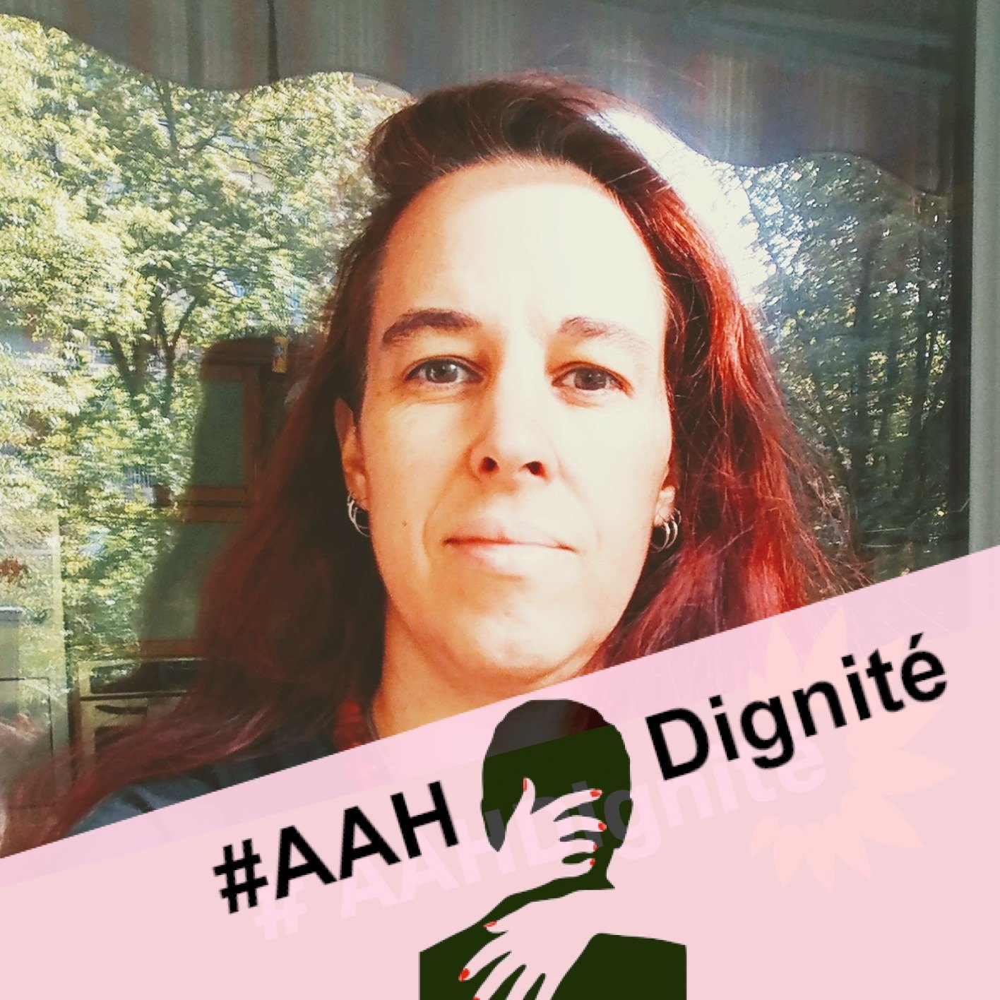

## Le contexte

Le 17 juin, l’Assemblée Nationale examinera à nouveau la proposition de loi visant à mettre fin à la prise en compte des revenus du conjoint pour le calcul de l’Allocation Adulte Handicapé (AAH). Une réforme demandée par de nombreuses personnes handicapées et leurs associations depuis la création de l’AAH par la loi d’orientation en faveur des personnes handicapées de 1975.

En effet, ce mode de calcul entraîne, pour beaucoup, une perte majeure de revenus lorsqu’elles se mettent en couple. Ceci les pousse à décohabiter, à se cacher, ou même à renoncer à former un couple. Ce mode de calcul, en les rendant dépendantes financièrement de leur conjoint(e), mine leur autonomie, leur estime et favorise abus et violences conjugales. Il doit être réformé !               

Nous  avons atteint ce stade grâce au soutien, ces dernières années, de plusieurs de nos représentants politiques sensibles à ces difficultés. Grâce aussi à une mobilisation des personnes concernées à la mesure de l’immense injustice qu’elles vivent. Les deux derniers évènements ont été, tout d’abord, la pétition sur le site du Sénat, rapidement signée par plus de 108 000 personnes et qui a permis l’étude et l’adoption par le Sénat, le 9 mars dernier, de la proposition de loi, portée par le sénateur Philippe Mouiller.
Puis finalement, le 18 mars, afin d’assurer une date de retour rapide vers l’Assemblée Nationale, la mise à l’ordre du jour de la proposition par le groupe de la Gauche démocrate et républicaine à l’une des séances mensuelles prévues pour être à l’initiative des groupes d’opposition ou minoritaires. Ce sera donc la séance du 17 juin 2021.  

## L’objectif    

Notre mobilisation doit continuer afin que le texte soit définitivement adopté à l’Assemblée Nationale. Nous devons montrer qu’au delà des chiffres, au delà des coûts, il y a des personnes, il y a des vies, il y a une réalité parfois très dure.

Témoignons ! Donnons à voir au grand public la réalité mal connue de nos vies de couple, que les médias puissent la relayer, que nos député(e)s soient informé(e)s et puissent prendre une décision éclairée. Ils ont la possibilité de faire entrer leurs noms dans l’histoire en faisant aboutir notre combat de 45 ans pour plus de justice sociale et plus d’autonomie pour les personnes handicapées !

## Membres du collectif 

**Kévin Polisano**, chercheur au CNRS en mathématiques et administrateur du site. Je publie sur mon [blog](https://www.kevinpolisano.fr/) des billets au sujet de l’AAH, tiens une [page](https://www.facebook.com/leprixdelamour) facebook de veille informationnelle et prends part aux débats politiques autour de cette problématique.

**Anne-Cécile Mouget**, sociologue. Je suis handie. Je milite depuis plusieurs années pour l’amélioration de nos politiques sociales du handicap, en particulier à travers mes travaux de recherche.

**Emmanuelle Kristensen**, grenobloise et ingénieure de recherche. Je suis en fauteuil, je communique avec une synthèse vocale. Je milite notamment à travers les réseaux sociaux et mon [blog](https://blog-enrouelibre.fr/).

**Franssie**, lyonnaise et atteinte d’une myopathie. Je sensibilise au handicap à travers des « contes et histoires » sur la différence. Je suis bénéficiaire de l’AAH et je suis plus que touchée par le « Prix de l’Amour ». Je milite pour cette cause à travers les réseaux sociaux et rêve d’un mariage s’handifférence.

## Retrouvez nous sur les réseaux

- [Twitter](https://x.com/leprixdelamour)
- [Facebook](https://www.facebook.com/leprixdelamour)
- [Instagram](https://www.instagram.com/leprixdelamour_aah/)
- [Email](mailto:contact@leprixdelamour.fr)
