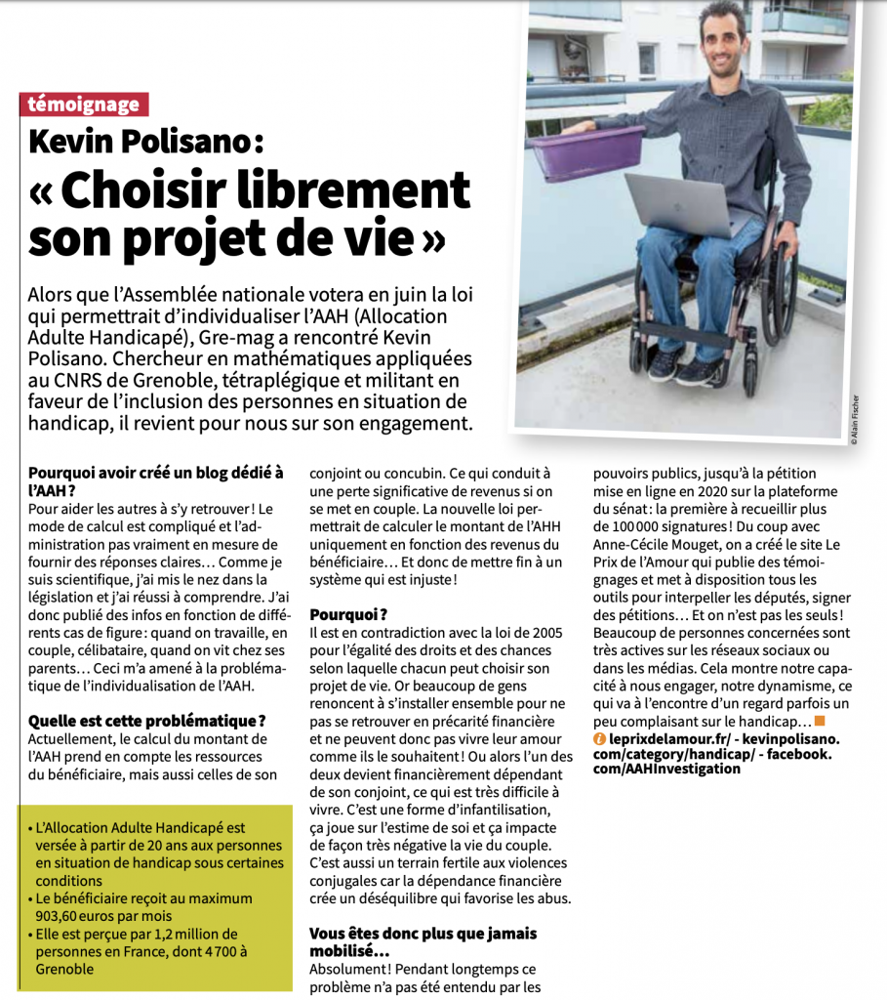
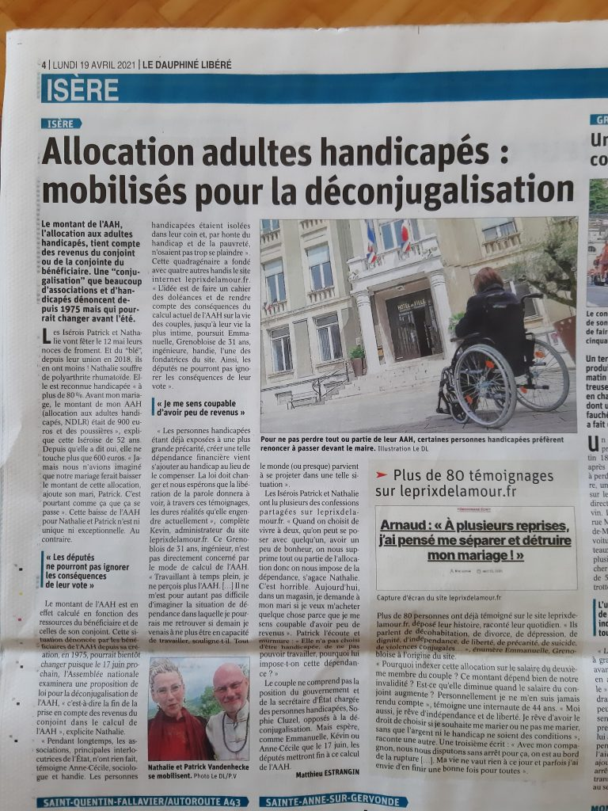

# 2022

## Juillet

- Le Monde : [« La déconjugalisation de l’allocation adulte handicapé votée à l’unanimité à l’Assemblée »](https://www.lemonde.fr/politique/article/2022/07/21/l-assemblee-nationale-adopte-a-l-unanimite-la-deconjugalisation-de-l-allocation-adulte-handicape_6135568_823448.html) (21/07/2022)
- France Bleu : [« Calendrier, public concerné : ce que que changera la déconjugalisation de l’allocation adulte handicapé »](https://www.francebleu.fr/infos/societe/l-assemblee-vote-la-deconjugalisation-de-l-allocation-adulte-handicape-aah-1658394314) (21/07/2022)
- France Info : [« Déconjugalisation AAH : quels changements après l’adoption de la loi ? »](https://www.francetvinfo.fr/politique/parlement-francais/assemblee-nationale/deconjugalisation-aah-quels-changements-apres-l-adoption-de-la-loi_5271793.html) (21/07/2022)
- LCI : [« Allocation adultes handicapés : pourquoi 45.000 bénéficiaires pourraient y perdre avec le nouveau calcul »](https://www.tf1info.fr/politique/allocation-adultes-handicapes-aah-deconjugalise-nouveau-calcul-pourquoi-45-000-beneficiaires-pourraient-y-perdre-2227097.html) (21/07/2022)
- Le Point : [« Allocation adulte handicapé : le nouveau calcul « favorise les familles aisées » »](https://www.lepoint.fr/politique/allocation-adulte-handicape-le-nouveau-calcul-favorise-les-familles-aisees-22-07-2022-2484047_20.php) (21/07/2022)
- Le Figaro : [« Thomas Mesnier (Horizons) seul député à voter contre la déconjugalisation de l’AAH »](https://www.lefigaro.fr/politique/thomas-mesnier-horizons-seul-depute-a-voter-contre-la-deconjugalisation-de-l-aah-20220721$) (21/07/2022)
- RTL : [« Qu’implique la déconjugalisation de l’Allocation adulte handicapé ? »](https://www.rtl.fr/actu/debats-societe/deconjugalisation-de-l-allocation-adulte-handicape-qu-implique-t-elle-7900173194) (21/07/2022)
- Faire Face : [« AAH : le combat pour la déconjugalisation aboutit enfin »](https://www.faire-face.fr/2022/07/21/aah-deconjugalisation-adoption/) (21/07/2022)
- Madmoizelle : [« L’Assemblée nationale vote la déconjugalisation de l’AAH »](https://www.madmoizelle.com/lassemblee-nationale-vote-la-deconjugalisation-de-laah-1417375) (21/07/2022)
- Huffingpost : [« La déconjugalisation de l’AAH adoptée à l’Assemblée nationale, une « grande victoire » »](https://www.huffingtonpost.fr/entry/la-deconjugalisation-de-laah-adoptee-a-lassemblee-nationale-une-grande-victoire_fr_62d8fdd0e4b0a6852c33d17a) (21/07/2022)
- Sud Ouest : [« Allocation adulte handicapé : l’Assemblée nationale vote la déconjugalisation »](https://www.sudouest.fr/france/allocation-adulte-handicape-l-assemblee-nationale-vote-la-deconjugalisation-11724099.php) (21/07/2022)
- Europe 1 : [« L’Assemblée nationale vote la déconjugalisation de l’allocation adulte handicapé »](https://www.europe1.fr/politique/lassemblee-vote-la-deconjugalisation-de-lallocation-adulte-handicape-4124351) (21/07/2022)
- Europe 1 : [« Déconjugalisation de l’allocation adulte handicapé : ce que va changer la réforme »](https://www.europe1.fr/sante/deconjugalisation-de-lallocation-adulte-handicape-ce-que-va-changer-la-reforme-4124379) (21/07/2022)
- Charente Libre : [« Allocation adulte handicapé : Thomas Mesnier seul député à voter contre la déconjugalisation »](https://www.charentelibre.fr/politique/allocations-aux-adultes-handicapes-le-depute-thomas-mesnier-seul-a-voter-contre-la-deconjugalisation-11728092.php) (21/07/2022)
- La Voix du Nord : [« Pouvoir d’achat : la déconjugalisation de l’Allocation adulte handicapé (AAH) votée à l’Assemblée »](https://www.lavoixdunord.fr/1208383/article/2022-07-21/pouvoir-d-achat-la-deconjugalisation-de-l-allocation-adulte-handicape-aah-votee) (21/07/2022)
- RFI : [« France: l’Assemblée vote la déconjugalisation de l’AAH, les bénéficiaires soulagés »](https://www.rfi.fr/fr/france/20220721-france-l-assembl%C3%A9e-vote-la-d%C3%A9conjugalisation-de-l-aah-les-b%C3%A9n%C3%A9ficiaires-soulag%C3%A9s) (21/07/2022)
- Handicap.fr : [« Ça y est, l’Assemblée a voté la déconjugalisation de l’AAH »](https://informations.handicap.fr/a-AAH-vote-deputes-assemblee-33305.php) (21/07/2022)
- Capital : [« Déconjugalisation de l’AAH : le profil des gagnants et des perdants de la réforme »](https://www.capital.fr/votre-argent/deconjugalisation-de-laah-le-profil-des-gagnants-et-des-perdants-de-la-reforme-1442158) (21/07/2022)
- Les Echos : [« L’Assemblée nationale vote la déconjugalisation de l’allocation adultes handicapés »](https://www.lesechos.fr/economie-france/social/lassemblee-nationale-accede-enfin-aux-attentes-des-handicapes-sur-leurs-allocations-1777757) (21/07/2022)
- La Croix : [« Allocation aux adultes handicapés : l’Assemblée nationale vote la déconjugalisation »](https://www.la-croix.com/France/Allocation-adultes-handicapes-lAssemblee-nationale-vote-deconjugalisation-2022-07-21-1201225780) (21/07/2022)
- Radio France : [« Ce que signifie la déconjugalisation de l’Allocation adulte handicapé (AAH) votée par les députés »](https://www.radiofrance.fr/franceinter/ce-que-signifie-la-deconjugalisation-de-l-allocation-adulte-handicape-aah-votee-par-les-deputes-5796504) (21/07/2022)
- Le JDD : [« La déconjugalisation de l’Allocation adulte handicapé approuvée par l’Assemblée »](https://www.lejdd.fr/Politique/la-deconjugalisation-de-lallocation-adulte-handicape-approuvee-par-lassemblee-4124358) (21/07/2022)
- LCI : [« La déconjugalisation de l’allocation adulte handicapé votée à l’unanimité à l’Assemblée »](https://www.tf1info.fr/politique/la-deconjugalisation-de-l-allocation-adulte-handicape-votee-a-l-unanimite-a-l-assemblee-2227082.html) (21/07/2022)
- L’Opinion : [« Loi pouvoir d’achat: l’Assemblée vote la revalorisation des prestations sociales et la déconjugalisation de l’AAH »](https://www.lopinion.fr/politique/loi-pouvoir-dachat-lassemblee-vote-la-revalorisation-des-prestations-sociales-et-la-deconjugalisation-de-laah) (21/07/2022)
- Challenges : [« France/Pouvoir d’achat : L’Assemblée approuve la déconjugalisation de l’AAH »](https://www.challenges.fr/top-news/france-pouvoir-d-achat-l-assemblee-approuve-la-deconjugalisation-de-l-aah_821775) (21/07/2022)
- L’Union : [« L’Assemblée vote la déconjugalisation de l’allocation adulte handicapé »](https://www.lunion.fr/id392849/article/2022-07-21/lassemblee-vote-la-deconjugalisation-de-lallocation-adulte-handicape) (21/07/2022)
- Le Progrès : [« La déconjugalisation de l’Allocation adulte handicapé votée par les députés »](https://www.leprogres.fr/societe/2022/07/21/la-deconjugalisation-de-l-allocation-adulte-handicape-votee-par-les-deputes) (21/07/2022)
- Le Quotidien : [« AAH : les revenus du conjoint ne sont plus pris en compte »](https://www.lequotidien.re/actualites/politique/aah/) (21/07/2022)
- Cnews : [« Allocation Adulte Handicapé : l’assemblée nationale a voté la fin du calcul des revenus du conjoint dans le versement de l’aide »](https://www.cnews.fr/france/2022-07-21/lassemblee-nationale-vote-la-deconjugalisation-de-lallocation-adulte-handicape) (21/07/2022)
- LCP : [« Pouvoir d’achat : les députés votent la déconjugalisation de l’AAH »](https://lcp.fr/actualites/pouvoir-d-achat-les-deputes-votent-la-deconjugalisation-de-l-aah-128639) (21/07/2022)
- La Provence : [« L’Assemblée vote la déconjugalisation de l’Allocation adulte handicapé »](https://www.laprovence.com/actu/en-direct/6845472/lassemblee-vote-la-deconjugalisation-de-lallocation-adulte-handicape.html) (21/07/2022)
- Ouest-France : [« L’Assemblée nationale a voté la déconjugalisation de l’Allocation adulte handicapé »](https://www.ouest-france.fr/sante/handicaps/l-assemblee-nationale-a-vote-la-deconjugalisation-de-l-allocation-adulte-handicape-23cf4450-08b3-11ed-809f-9e7ceb27185e) (21/07/2022)
- Le Figaro : [« L’Assemblée nationale vote la déconjugalisation de l’Allocation adulte handicapé »](https://www.lefigaro.fr/actualite-france/l-assemblee-vote-la-deconjugalisation-de-l-allocation-adulte-handicape-20220721) (21/07/2022)
- Capital : [« Allocation adultes handicapés : l’Assemblée nationale vote en faveur de la déconjugalisation »](https://www.capital.fr/economie-politique/allocation-adultes-handicapes-la-deconjugalisation-en-voie-detre-adoptee-1441380) (21/07/2022)
- BFMTV : [« L’assemblée nationale vote la déconjugalisation de l’allocation adulte handicapé »](https://www.bfmtv.com/politique/parlement/l-assemblee-nationale-vote-la-deconjugalisation-de-l-allocation-adulte-handicape_AD-202207200688.html) (21/07/2022)
- BFMTV : [« La déconjugalisation de l’AAH : un rare moment d’unité dans une assemblée en surchauffe »](https://www.bfmtv.com/politique/parlement/la-deconjugalisation-de-l-aah-un-rare-moment-d-unite-dans-une-assemblee-en-surchauffe_AV-202207210093.html) (21/07/2022)
- L’Express : [« Pourquoi la déconjugalisation de l’allocation adulte handicapé n’est pas pour tout de suite »](https://www.lexpress.fr/actualite/societe/famille/pourquoi-la-deconjugalisation-de-l-allocation-adulte-handicapee-n-est-pas-pour-tout-de-suite_2177338.html) (20/07/2022)
- **Libération : [« La déconjugalisation de l’allocation aux adultes handicapés votée à l’Assemblée »](https://www.liberation.fr/societe/lallocation-aux-adultes-handicapes-enfin-sur-la-voie-de-la-deconjugalisation-20220719_SXRKS4FIHZGO7IL7LDWOKWYL34/) (19/07/2022)**
- **Handicap.fr : [« Déconjugalisation de l’AAH : quels seraient les perdants? »](https://informations.handicap.fr/a-deconjugalisation-aah-quels-seraient-les-perdants-33279.php) (19/07/2022)**
- LCI : [« Pourquoi la déconjugalisation de l’AAH est attendue avec impatience par ses bénéficiaires ? »](https://www.tf1info.fr/politique/pourquoi-la-deconjugalisation-de-l-allocation-adultes-handicapes-aah-est-attendue-avec-impatience-par-ses-beneficiaires-2226873.html) (19/07/2022)
- Public Sénat : [« AAH : la déconjugalisation entrera « en vigueur au 1er octobre ou au 1er novembre 2023″ selon Olivier Dussopt »](https://www.publicsenat.fr/article/parlementaire/aah-la-deconjugalisation-entrera-en-vigueur-au-1er-octobre-ou-au-1er-novembre) (19/07/2022)
- RMC : [« »Le manque à gagner est de 30.000 euros ». Quand le mariage divise l’allocation adulte handicapé »](https://rmc.bfmtv.com/actualites/societe/le-manque-a-gagner-est-de-30-000-euros-quand-le-mariage-divise-l-allocation-adulte-handicape_AV-202207190296.html) (19/07/2022)
- Le JDD : [« Déconjugalisation de l’allocation adulte handicapé : « Il faut aller le plus vite possible » »](https://www.lejdd.fr/Politique/deconjugalisation-de-lallocation-adulte-handicape-il-faut-aller-le-plus-vite-possible-4124126) (19/07/2022)
- Handicap.fr : [« AAH déconjugalisée : pas avant le 1er octobre 2023 ? »](https://informations.handicap.fr/a-aah-deconjugalisation-octobre-2023-33271.php) (18/07/2022)
- Le Parisien : [« Déconjugalisation de l’allocation aux adultes handicapés : «Cette injustice doit être réglée au plus vite»… »](https://www.leparisien.fr/economie/deconjugalisation-de-lallocation-aux-adultes-handicapes-cette-injustice-doit-etre-reglee-au-plus-vite-18-07-2022-QT7ZVTD3XBGPVI5VVUVNFJFYWM.php) (18/07/2022)
- Handirect : [« Déconjugalisation de l’AAH, vote historique à l’Assemblée nationale »](https://handirect.fr/aah-et-deconjugalisation-adoptee-par-assemblee-nationale/) (13/07/2022)
- LCP : [« Déconjugalisation de l’AAH : majorité et oppositions veulent s’accorder sur un amendement commun »](https://lcp.fr/actualites/deconjugalisation-de-l-aah-majorite-et-oppositions-veulent-s-accorder-sur-un-amendement) (13/07/2022)
- Le Figaro : [« Déconjugalisation de l’AAH : les députés repoussent la décision à l’hémicycle »](https://www.lefigaro.fr/flash-eco/deconjugalisation-de-l-aah-les-deputes-repoussent-la-decision-a-l-hemicycle-20220713) (13/07/2022)
- Handicap.fr : [« Déconjugalisation AAH : les députés repoussent la décision »](https://informations.handicap.fr/a-decision-deputes-AAH-repousse-deconjugalisation-33259.php) (13/07/2022)
- France 3 : [« Allocation adulte handicapé : une adoption peut-être dès cet été, le député Yannick Favennec veut le croire »](https://france3-regions.francetvinfo.fr/pays-de-la-loire/mayenne/allocation-adulte-handicape-une-adoption-peut-etre-des-cet-ete-le-depute-yannick-favennec-veut-le-croire-2580388.html) (12/07/2022)
- Sud Ouest : [« Déconjugalisation de l’Allocation adultes handicapés : le gouvernement prévoit un dispositif transitoire »](https://www.sudouest.fr/sante/deconjugalisation-de-l-allocation-adultes-handicapes-le-gouvernement-prevoit-un-dispositif-transitoire-11628889.php) (12/07/2022)
- Libération : [« Le gouvernement se prononce en faveur de la déconjugalisation de l’allocation adultes handicapés »](https://www.liberation.fr/societe/sante/le-gouvernement-se-prononce-en-faveur-de-la-deconjugalisation-de-lallocation-adultes-handicapes-20220712_QSQDCTNHAVFHZECE3HSPCUFPYY/) (12/07/2022)
- Ouest-France : [« Déconjugalisation de l’Allocation Adultes Handicapés : «un dispositif transitoire» sera mis en place »](https://www.ouest-france.fr/sante/handicaps/deconjugalisation-de-l-allocation-adultes-handicapes-un-dispositif-transitoire-sera-mis-en-place-c2bc9184-01f7-11ed-8eb0-a8ab850b8757) (12/07/2022)
- La Provence : [« Déconjugalisation de l’AAH : le gouvernement prévoit un dispositif transitoire »](https://www.laprovence.com/actu/en-direct/6835277/deconjugalisation-de-laah-le-gouvernement-prevoit-un-dispositif-transitoire.html) (12/07/2022)
- Midi Libre : [« Allocation adultes handicapés : bientôt un nouveau mode de calcul pour l’AAH, découvrez ce qui change »](https://www.midilibre.fr/2022/07/11/allocation-adultes-handicapes-bientot-un-nouveau-mode-de-calcul-pour-laah-decouvrez-ce-qui-change-10428930.php) (11/07/2022)
- 20 minutes : [« Handicap : Atteinte de surdité profonde, Fiona se bat pour conserver son allocation »](https://www.20minutes.fr/societe/3322287-20220709-handicap-atteinte-surdite-profonde-fiona-bat-conserver-allocation) (09/07/2022)
- Handicap.fr : [« AAH : le député Pradié reproche au gouvernement son « flou » »](https://informations.handicap.fr/a-aah-depute-pradie-reproche-gouvernement-flou-33237.php) (08/07/2022)
- Le JDD : [« Réforme de l’allocation aux adultes handicapés : pourquoi le revirement du gouvernement était attendu »](https://www.lejdd.fr/Societe/reforme-de-lallocation-aux-adultes-handicapes-pourquoi-le-revirement-du-gouvernement-etait-attendu-4122359) (08/07/2022)
- Le Quotidien : [« La déconjugalisation de l’AAH bouleverse le monde du handicap »](https://www.lequotidien.re/actualites/societe/la-deconjugalisation-de-laah-bouleverse-le-monde-du-handicap/) (08/07/2022)
- Public Sénat : [« Déconjugalisation de l’AAH : « Il n’y a que les imbéciles qui ne changent jamais d’avis » se félicite Stéphane Peu »](https://www.publicsenat.fr/article/parlementaire/deconjugalisation-de-l-aah-il-n-y-a-que-les-imbeciles-qui-ne-changent-jamais-d) (08/07/2022)
- Capital : [« Déconjugalisation de l’AAH : l’opposition presse le gouvernement d’agir vite »](https://www.capital.fr/economie-politique/deconjugalisation-de-laah-lopposition-presse-le-gouvernement-dagir-vite-1441040) (07/07/2022)
- La Croix : [« Allocation aux adultes handicapés, bientôt un nouveau mode de calcul »](https://www.la-croix.com/France/Allocation-adultes-handicapes-bientot-nouveau-mode-calcul-2022-07-07-1201223881) (07/07/2022)
- Faire Face : [« Allocation aux adultes handicapés : un pas vers la déconjugalisation »](http://07/07/2022) (07/07/2022)
- Handicap.fr : [« AAH : Borne annonce sa déconjugalisation, enfin ! »](https://informations.handicap.fr/a-aah-gouvernement-modifier-mode-calcul-33215.php) (06/07/2022)
- Public Sénat : [« Handicap : Elisabeth Borne annonce la déconjugalisation de l’AAH »](https://www.publicsenat.fr/article/parlementaire/handicap-elisabeth-borne-annonce-la-deconjugalisation-de-l-aah-215941) (06/07/2022)
- L’Obs : [« Elisabeth Borne ouvre la voie à la déconjugalisation de l’allocation adulte handicapé »](https://www.nouvelobs.com/politique/20220706.OBS60606/elisabeth-borne-ouvre-la-voie-a-la-deconjugalisation-de-l-allocation-adulte-handicape.html) (06/07/2022)
- La Depeche : [« Allocation adulte handicapé : Élisabeth Borne veut une réforme « en profondeur » avec un principe de « déconjugalisation » »](https://www.ladepeche.fr/2022/07/06/allocation-adulte-handicape-elisabeth-borne-veut-une-reforme-en-profondeur-avec-un-principe-de-deconjugalisation-10419483.php) (06/07/2022)
- L’Indépendant : [« Allocation adulte handicapé : refusée plusieurs fois par la majorité lors du précédent quinquennat, Élisabeth Borne annonce sa déconjugalisation »](https://www.lindependant.fr/2022/07/06/allocation-adulte-handicape-refusee-plusieurs-fois-par-la-majorite-lors-du-precedent-quinquennat-elisabeth-borne-annonce-sa-deconjugalisation-10419653.php) (06/07/2022)
- France Bleu : [« Allocation adulte handicapé : « Ne plus choisir entre l’amour et le portefeuille » selon Yannick Favennec »](https://www.francebleu.fr/infos/politique/aah-deconjugalisee-ne-plus-choisir-entre-l-amour-et-le-portefeuille-explique-le-depute-yannick-1656677882) (01/07/2022)

## Juin

- Handicap.fr : [« Déconjugalisation AAH : les députés vont devoir la voter? »](https://informations.handicap.fr/a-AAH-individualisation-couple-deputes-vote-33147.php) (25/06/2022)
- Handicap.fr : [« Elisabeth Borne : polémique autour de l’AAH d’une auditrice »](https://informations.handicap.fr/a-borne-AAH-handicap-emploi-polemique-33033.php) (08/06/2022)
- Ouest France : [« Échange entre Élisabeth Borne et une femme handicapée : la polémique en trois questions »](https://www.ouest-france.fr/politique/elisabeth-borne/echange-entre-elisabeth-borne-et-une-femme-handicapee-la-polemique-en-trois-questions-759bd464-e6fe-11ec-8458-b2f5aa0496fd) (08/06/2022)
- Huffingpost : [« Borne choque avec cette réponse sur l’allocation adulte handicapé »](https://www.huffingtonpost.fr/entry/borne-choque-avec-cette-reponse-sur-lallocation-adulte-handicape_fr_629f5c74e4b090b53b89bf74) (07/06/2022)
- Ouest-France : [« Handicap : ce couple est contraint de dissimuler son histoire d’amour »](https://www.ouest-france.fr/nouvelle-aquitaine/bressuire-79300/handicap-ce-couple-est-contraint-de-dissimuler-son-histoire-d-amour-d96caa3c-e324-11ec-afe2-d5ee186a9723) (03/06/2022)

## Mai

- L’Union : [« Handicapé, cet habitant de Villers-Cotterêts se marie et doit rembourser 7000 euros à la CAF »](https://abonne.lunion.fr/id373179/article/2022-05-20/handicape-cet-habitant-de-villers-cotterets-se-marie-et-doit-rembourser-7000) (20/05/2022)

## Avril

- L’Humanité : [« Le chef de l’État attendu sur le handicap »](https://www.humanite.fr/societe/emmanuel-macron/le-chef-de-l-etat-attendu-sur-le-handicap-747856) (26/04/2022)
- Être en Réseau : [« Moi Président : Emmanuel Macron »](https://etre-reseau.org/magazine/moi-president-emmanuel-macron) (23/04/2022)
- Faire-Face : [« AAH en couple : Macron veut « avancer » mais ne promet pas de déconjugaliser »](https://www.faire-face.fr/2022/04/22/non-macron-pas-promis-deconjugaliser-aah/) (22/04/2022)
- Euractiv : [« Débat Macron-Le Pen : l’allocation aux adultes handicapés cristallise les tensions dès les premières minutes »](https://www.euractiv.fr/section/sante-modes-de-vie/news/debat-macron-le-pen-lallocation-aux-adultes-handicapes-cristallise-les-tensions-des-les-premieres-minutes/) (21/04/2022)
- Les Échos : [« Présidentielle : Emmanuel Macron prêt à « bouger » sur la question des personnes handicapées en couple »](https://www.lesechos.fr/elections/presidentielle/presidentielle-emmanuel-macron-pret-a-bouger-sur-la-question-des-personnes-handicapees-en-couple-1401991) (21/04/2022)
- Libération : [« Déconjugalisation de l’allocation aux adultes handicapés: «Le jour où il y aura une victoire, c’est quand cette loi sera passée» »](https://www.liberation.fr/societe/deconjugalisation-de-lallocation-aux-adultes-handicapes-le-jour-ou-il-y-aura-une-victoire-cest-quand-cette-loi-sera-passee-20220421_TUD7P2D4XZBJ5DCN7GDIFL4P4Y/) (21/04/2022)
- 20 minutes : [« Présidentielle 2022 : Au-delà de l’AAH, que proposent Emmanuel Macron et Marine Le Pen sur le handicap ? »](https://www.20minutes.fr/elections/3274455-20220421-presidentielle-2022-dela-aah-proposent-emmanuel-macron-marine-pen-handicap) (21/04/2022)
- L’Indépendant : [« Présidentielle 2022 - Débat - Macron veut désormais « déconjugaliser l’allocation adulte handicapé » »](https://www.lindependant.fr/2022/04/20/presidentielle-2022-debat-macron-veut-desormais-deconjugaliser-lallocation-adulte-handicape-10248110.php) (20/04/2022)
- La Dépêche : [« Débat présidentiel : « C’est vrai que le gouvernement n’a pas voté cette mesure », le mea culpa de Macron sur l’allocation adulte handicapé »](https://www.ladepeche.fr/2022/04/20/debat-presidentiel-cest-vrai-que-le-gouvernement-na-pas-vote-pour-cette-mesure-le-mea-culpa-de-macron-sur-lallocation-aux-adultes-handicapes-10248106.php) (20/04/2022)
- BFMTV : [« Débat d’entre deux tours : Emmanuel Macron finalement favorable à la déconjugalisation de l’AAH »](https://www.bfmtv.com/economie/debat-d-entre-deux-tours-emmanuel-macron-finalement-favorable-a-la-deconjugalisation-de-l-aah_AV-202204200635.html) (20/04/2022)
- Sud-Ouest : [« Allocation handicapés : Macron promet de « bouger » sur sa déconjugalisation »](https://www.sudouest.fr/societe/allocation-handicapes-macron-promet-de-bouger-sur-sa-deconjugalisation-10614588.php) (15/04/2022)
- Libération : [« Macron et la déconjugalisation de l’Allocation adultes handicapés: une volte-face opportuniste »](https://www.liberation.fr/politique/elections/macron-et-la-deconjugalisation-de-lallocation-adultes-handicapes-une-volte-face-opportuniste-20220415_DLOB4JDS5JFP3BRDM5G7DL5JVQ/) (15/04/2022)
- Public Sénat : [« Macron « prêt » à revoir l’Allocation adultes handicapés, à contre-courant de l’action de la majorité pendant cinq ans »](https://www.publicsenat.fr/article/politique/macron-pret-a-revoir-le-fonctionnement-de-l-aah-a-contre-courant-de-l-action-de-la) (15/04/2022)
- Ouest-France : [« Allocation adulte handicapé : Emmanuel Macron promet de « bouger » pour revoir son calcul »](https://www.ouest-france.fr/elections/presidentielle/presidentielle-on-va-bouger-sur-la-deconjugalisation-de-l-aah-promet-emmanuel-macron-a5636af6-bc8b-11ec-a567-e86cf18d060a) (15/04/2022)
- Handicap.fr : [« Déconjugalisation AAH : Macron veut finalement « bouger » »](https://informations.handicap.fr/a-AAH-deconjugalisation-macron-bouger-32739.php) (15/04/2022)
- Les Échos : [« Allocation handicapés : les promesses de l’entre-deux tours de Macron »](https://www.lesechos.fr/politique-societe/societe/allocation-handicapes-les-promesses-de-lentre-deux-tours-de-macron-1401083) (15/04/2022)
- BFMTV : [« Allocation adulte handicapé : Macron promet de « bouger » sur sa déconjugalisation »](https://www.bfmtv.com/economie/economie-social/social/allocation-adulte-handicapes-emmanuel-macron-promet-de-bouger-sur-sa-deconjugalisation_AD-202204150438.html) (15/04/2022)
- Marianne : [« Déconjugalisation de l’AAH : Macron veut finalement « bouger »… mais sans dire comment »](https://www.marianne.net/politique/macron/deconjugalisation-de-laah-macron-veut-finalement-bouger-mais-sans-dire-comment) (15/04/2022)
- La Croix : [« Allocation aux adultes handicapés : Macron entend finalement « bouger » sur la déconjugalisation »](https://www.la-croix.com/France/Allocation-adultes-handicapes-Macron-entend-finalement-bouger-deconjugalisation-2022-04-15-1201210554)
- France Info : [« Présidentielle 2022 : pour Emmanuel Macron, « on doit bouger » sur l’allocation aux adultes handicapés »](https://www.francetvinfo.fr/elections/presidentielle/presidentielle-2022-pour-emmanuel-macron-on-doit-bouger-sur-l-allocation-adulte-handicape_5083564.html)
- Le Monde : [« Individualisation de l’allocation aux adultes handicapés : Emmanuel Macron affirme vouloir « bouger sur ce point » »](https://www.lemonde.fr/election-presidentielle-2022/article/2022/04/15/individualisation-de-l-allocation-aux-adultes-handicapes-emmanuel-macron-affirme-vouloir-bouger-sur-ce-point_6122375_6059010.html)

## Mars

- France Info : [« Handébat 2022 : les propositions des candidats à la présidentielle sur l’allocation aux adultes handicapés »](https://www.francetvinfo.fr/sante/handicap/handebat-2022-les-propositions-des-candidats-a-la-presidentielle-sur-l-allocation-aux-adultes-handicapes_5039326.html) (23/03/2022)

## Février

- Nouvel Obs : [« Gaspard Koenig : « Cessons de mêler argent et amour ! » »](https://www.nouvelobs.com/idees/20220210.OBS54291/gaspard-koenig-cessons-de-meler-argent-et-amour.html) (10/02/2022)
- Le JDD : [« Handicap : ce que les associations attendent des candidats à la présidentielle »](https://www.lejdd.fr/Societe/handicap-ce-que-les-associations-attendent-des-candidats-a-la-presidentielle-4091290) (01/02/2022)

## Janvier

- La Voix du Nord : [« Allocation aux adultes handicapés: qui va bénéficier de la hausse de 110 euros ? »](https://www.lavoixdunord.fr/1133366/article/2022-01-28/allocation-aux-adultes-handicapes-qui-va-beneficier-de-la-hausse-de-110-euros) (28/01/2022)
- RTL : [« Allocation adultes handicapés : le mode de calcul change pour les bénéficiaires en couple »](https://www.rtl.fr/actu/debats-societe/allocation-adultes-handicapes-le-mode-de-calcul-change-pour-les-beneficiaires-en-couple-7900117579) (25/01/2022)
- Midi Libre : [« Allocation adultes handicapés : qui va bénéficier de la hausse de 110 euros avec la nouvelle mesure ? »](https://www.midilibre.fr/2022/01/25/allocation-adultes-handicapes-qui-va-beneficier-de-la-hausse-de-110-euros-avec-la-nouvelle-mesure-10067370.php) (25/01/2022)
- Sud Ouest : [« Handicap : le calcul de l’AAH modifié pour les bénéficiaires en couple »](https://www.sudouest.fr/economie/social/handicap-le-calcul-de-l-aah-modifie-pour-les-beneficiaires-en-couple-7984543.php) (24/01/2022)
- Ouest France : [« Allocation adultes handicapés : Le mode de calcul change pour les bénéficiaires en couple »](https://www.ouest-france.fr/sante/handicaps/allocation-adultes-handicapes-le-mode-de-calcul-change-pour-les-beneficiaires-en-couple-2b3297c9-945e-4e64-b8ff-494febcd179d) (24/01/2022)
- Le Parisien : [« Allocation adulte handicapés : le gouvernement met en place un nouveau mode de calcul »](https://www.leparisien.fr/societe/sante/allocation-adulte-handicapes-le-gouvernement-met-en-place-un-nouveau-mode-de-calcul-24-01-2022-7DWRGZNZPVHZZHL7PCYFR2633Q.php) (24/01/2022)
- Capital : [« Allocation adultes handicapés : le nouveau mode de calcul pour les couples instauré »](https://www.capital.fr/votre-argent/allocation-adultes-handicapes-le-nouveau-mode-de-calcul-pour-les-couples-instaure-1426178) (21/01/2022)
- Madmoizelle : [« La question du *validisme* sera-t-elle prise au sérieux par les candidats à la *présidentielle 2022* ? »](https://www.madmoizelle.com/la-question-du-validisme-sera-t-elle-prise-au-serieux-par-les-candidats-a-la-presidentielle-2022-1228990) (14/01/2022)

# 2021

## Décembre

- Ouest-France : [« Allocation adulte handicapé en Charente-Maritime : « Être dépendant de ma compagne, psychologiquement, ce serait dur » »](https://www.sudouest.fr/charente-maritime/jonzac/allocation-adulte-handicape-en-charente-maritime-etre-dependant-de-ma-compagne-psychologiquement-ce-serait-dur-7140993.php) (08/12/2021)
- Handicap.fr : [« AAH en couple : coup de gueule de l’humoriste Ferroni »](https://informations.handicap.fr/a-individualisation-aah-ferroni-rejet-31975.php) (06/12/2021)
- LCP : [« Handicap : L’assemblée repousse une nouvelle fois la déconjugalisation de l’AAH »](https://lcp.fr/actualites/handicap-l-assemblee-repousse-une-nouvelle-fois-la-deconjugalisation-de-l-aah-92085) (03/12/2021)
- NouvelObs : [« L’individualisation de l’allocation adultes handicapés à nouveau rejetée par les députés »](https://www.nouvelobs.com/societe/20211203.OBS51743/l-individualisation-de-l-allocation-adultes-handicapes-a-nouveau-rejetee-par-les-deputes.html) (03/12/2021)
- La Croix : [« Allocation adultes handicapés : les députés rejettent son individualisation »](https://www.la-croix.com/France/Allocation-adultes-handicapes-deputes-rejettent-individualisation-2021-12-03-1201188318) (03/12/2021)
- Marianne : [« Individualisation de l’AAH : nouveau rejet par les députés »](https://www.marianne.net/societe/deboulonnage-a-new-york-violences-aux-antilles-et-aah-retoquee-les-3-infos-de-la-nuit) (03/12/2021)
- Positivr : [« Allocation adulte handicapé : Nicole Ferroni brocarde les députés de la majorité »](https://positivr.fr/rejet-aah-deputes-nicole-ferroni/) (03/12/2021)
- Konbini : [« L’individualisation de l’allocation aux personnes handicapées une nouvelle fois rejetée par les députés »](https://news.konbini.com/societe/lindividualisation-de-lallocation-aux-personnes-handicapees-une-nouvelle-fois-rejetee-par-les-deputes/) (03/12/2021)
- Madmoizelle : [« Encore un non : l’Assemblée nationale retoque à nouveau l’individualisation de l’AAH »](https://www.madmoizelle.com/encore-un-non-lassemblee-nationale-retoque-a-nouveau-lindividualisation-de-laah-1219404) (03/12/2021)
- L’info.re : [« L’individualisation de l’allocation aux adultes handicapés retoquée à nouveau par les députés »](https://www.linfo.re/france/politique/l-individualisation-de-l-allocation-aux-adultes-handicapes-retoquee-a-nouveau-par-les-deputes) (03/12/2021)
- Euronews : [« Handicap : l’inclusion sociale, chère au gouvernement français, reste illusoire »](https://fr.euronews.com/2021/12/02/handicap-l-inclusion-sociale-chere-au-gouvernement-francais-reste-illusoire) (03/12/2021)
- Actu.fr : [« Sarthe : dans un clip, ils interpellent Emmanuel Macron sur le sort des personnes handicapées »](https://actu.fr/societe/video-sarthe-dans-un-clip-ils-interpellent-emmanuel-macron-sur-le-sort-des-personnes-handicapees_46884104.html) (03/12/2021)
- Le Figaro : [« Allocation adulte handicapé : ces personnes contraintes de choisir entre vie de couple et indépendance financière »](https://www.lefigaro.fr/actualite-france/allocation-adulte-handicape-ces-personnes-contraintes-de-choisir-entre-vie-de-couple-et-independance-financiere-20211202) (02/12/2021)
- Handicap.fr : [« AAH en couple devant l’Assemblée : c’est encore un non! »](https://informations.handicap.fr/a-aah-couple-assemblee-2-decembre-et-de-trois-31811.php) (02/12/2021)
- Capital : [« Allocation adultes handicapés : une mauvaise nouvelle… avant une compensation à venir pour les particuliers »](https://www.capital.fr/votre-argent/allocation-adultes-handicapes-une-mauvaise-nouvelle-avant-une-compensation-a-venir-pour-les-particuliers-1421849) (02/21/2021)
- Le Figaro : [« Individualisation de l’allocation handicapés: nouveau rejet par les députés »](https://www.lefigaro.fr/flash-eco/individualisation-de-l-allocation-handicapes-nouveau-rejet-par-les-deputes-20211202) (02/12/2021)
- France Bleu : [« Allocation adulte handicapé : « Je suis entièrement dépendante de mon mari » »](https://www.francebleu.fr/infos/societe/allocation-adulte-handicape-je-suis-entierement-dependante-de-mon-mari-1638385280) (02/12/2021)
- France Info : [« Allocation aux adultes handicapés : les députés rejettent à nouveau son individualisation »](https://www.francetvinfo.fr/sante/handicap/allocation-aux-adultes-handicapes-les-deputes-rejettent-a-nouveau-son-individualisation_4867337.html) (02/12/2021)
- Le Monde : [« Individualisation de l’allocation handicapés : nouveau rejet par les députés »](https://www.lemonde.fr/politique/article/2021/12/02/individualisation-de-l-allocation-handicapes-nouveau-rejet-par-les-deputes_6104520_823448.html) (02/12/2021)
- **Revue La Déferlante : [« « J’ai dû renoncer à une vie de couple pour ne pas perdre mon allocation » »](https://revueladeferlante.fr/jai-du-renoncer-a-une-vie-de-couple-pour-ne-pas-perdre-mon-allocation/) (01/12/2021)**

## Novembre

- France Bleu : [« Handicap : une réforme pour améliorer l’autonomie des personnes handicapées »](https://www.francebleu.fr/infos/economie-social/handicap-une-reforme-pour-ameliorer-l-autonomie-des-personnes-handicapees-1638186653) (29/11/2021)
- France Bleu : [« Allocation adulte handicapé : « Je mets ma santé en danger, mais je ne veux plus dépendre de mon mari » »](https://www.francebleu.fr/infos/economie-social/allocation-adulte-handicapee-je-mets-ma-sante-en-danger-mais-je-ne-veux-plus-dependre-de-mon-mari-1638130703) (28/11/2021)
- France Inter : [« Faut-il déconjugaliser l’allocation aux adultes handicapés ? »](https://www.franceinter.fr/emissions/le-telephone-sonne/le-telephone-sonne-du-vendredi-26-novembre-2021) (26/11/2021)
- Handicap.fr : [« Prime de Noël et AAH : toujours pas en 2021? »](https://informations.handicap.fr/a-prime-noel-et-aah-toujours-pas-en-2021-31919.php) (26/11/2021)
- NeonMag : [« »Le couple, pour nous, c’est accepter de se retrouver en situation de dépendance », Harriet de G., militante handi-féministe »](https://www.neonmag.fr/le-couple-pour-nous-cest-accepter-de-se-retrouver-en-situation-de-dependance-harriet-de-g-militante-handi-feministe-557455.html) (19/11/2021)
- France Inter : [« Que deviennent les deux pétitions qui ont dépassé les 100.000 signatures sur la plateforme du Sénat ? »](https://www.franceinter.fr/politique/que-deviennent-les-deux-petitions-qui-ont-depasse-les-100-000-signatures-sur-la-plateforme-du-senat) (12/11/2021)
- Seronet : [« AAH : les ONG en appellent aux chambres »](https://seronet.info/article/aah-les-ong-en-appellent-aux-chambres-91402) (05/11/2021)
- France Assos Santé : [« AAH : Stop à la dépendance financière dans le couple – Lettre ouverte à Monsieur le président du Sénat et à Monsieur le président de l’Assemblée nationale »](https://www.france-assos-sante.org/communique_presse/aah-stop-a-la-dependance-financiere-dans-le-couple-lettre-ouverte-a-monsieur-le-president-du-senat-et-a-monsieur-le-president-de-lassemblee-nationale/) (04/11/2021)

## Octobre

- Midi Libre : [« Montpellier : la future allocation adulte handicapé, où ça en est ? »](https://www.midilibre.fr/2021/10/30/montpellier-la-future-allocation-adulte-handicape-ou-ca-en-est-9898581.php) (30/10/2021)
- Ouest France : [« Vitré. Allocation adultes handicapés : « C’est étrange de voter ce vœu en conseil », dit la députée »](https://www.ouest-france.fr/bretagne/vitre-35500/vitre-allocation-adultes-handicapes-c-est-etrange-de-voter-ce-voeu-en-conseil-dit-la-deputee-5a436d70-34a3-11ec-8358-3d9f0f46f467) (28/10/2021)
- M6 : [« L’allocation adulte handicapé fait débat »](https://www.6play.fr/le-1945-p_1058/1945-du-mercredi-27-octobre-c_12901731) (27/10/2021)
- Ouest France : [« « La dernière semaine du mois c’est pâtes et Knacki », Anne raconte comment elle gère son budget »](https://www.ouest-france.fr/economie/consommation/la-derniere-semaine-du-mois-c-est-pates-et-knacki-anne-raconte-comment-elle-gere-son-budget-65e4b8de-3253-11ec-8668-6a8a63483124) (22/10/2021)
- Handicap.fr : [« Individualisation AAH : des députés remettent la pression »](https://informations.handicap.fr/a-AAH-individualisation-pression-assemblee-31707.php) (22/10/2021)
- Le fil d’Actu : « Handicap : les députés contre l’autonomie des personnes » (21/10/2021)
- Le Monde : [« Stéphanie Simon, une vie en fauteuil et le sentiment d’une injustice de l’Etat »](https://www.lemonde.fr/fragments-de-france/article/2021/10/20/stephanie-simon-une-vie-en-fauteuil-et-le-sentiment-d-une-injustice-de-l-etat_6099078_6095744.html) (20/10/2021)
- Ouest France : [« Vitré. Adultes handicapés : les élus soutiennent la déconjugalisation de l’allocation »](https://www.ouest-france.fr/bretagne/vitre-35500/vitre-adultes-handicapes-les-elus-soutiennent-la-deconjugalisation-de-l-allocation-5d50e488-30c1-11ec-a362-2875df5c4251) (19/10/2021)
- Yanous : [« La fille de Sophie »](https://www.yanous.com/news/editorial/edito211015.html) (15/10/2021)
- L’Union : [« Allocation adultes handicapés : le Sénat vote en faveur de la déconjugalisation »](https://www.lunion.fr/id302161/article/2021-10-12/allocation-adultes-handicapes-le-senat-vote-en-faveur-de-la-deconjugalisation) (12/10/2021)
- Le Progrès : [« Réforme de l’allocation adultes handicapés : le bras de fer continue au Sénat »](https://www.leprogres.fr/politique/2021/10/12/reforme-de-l-allocation-adultes-handicapes-le-bras-de-fer-continue-au-senat) (12/10/2021)
- Public Sénat : [« Philippe Mouiller pour parler de l’Allocation adulte handicapé et de son mode de calcul »](https://www.dailymotion.com/video/x84s1b0) (11/10/2021)
- Public Sénat : [« Allocation adultes handicapés : « Position sectaire », « froideur technocratique »… Aurélien Pradié fustige la position du gouvernement »](https://www.publicsenat.fr/article/parlementaire/l-individualisation-de-l-aah-rejetee-position-sectaire-froideur-technocratique?utm_term=Autofeed) (08/10/2021)
- Le Point : [« Adultes handicapés : la charge d’un député centriste contre le gouvernement »](https://www.lepoint.fr/politique/adultes-handicapes-la-charge-d-un-depute-centriste-contre-le-gouvernement-08-10-2021-2446740_20.php) (08/10/2021)
- Marianne : [« »Démago » contre « sale méthode » : le débat sur l’allocation handicapés tourne court »](https://www.marianne.net/politique/gouvernement/demago-contre-sale-methode-le-debat-sur-lallocation-handicapes-tourne-court) (08/10/2021)
- Faire Face : [« AAH en couple : devant l’Assemblée, le Gouvernement reste buté »](https://www.faire-face.fr/2021/10/08/aah-en-couple-devant-lassemblee-le-gouvernement-reste-bute/) (08/10/2021)
- L’internaute.fr : [« AAH 2021 : pourquoi elle a (encore) fait débat »](https://www.linternaute.com/argent/guide-de-vos-finances/1477490-aah-2021-pourquoi-elle-va-encore-faire-debat/) (08/10/2021)
- Public Sénat : [« Allocation aux adultes handicapés : la « déconjugalisation », à nouveau rejetée à l’Assemblée, revient au Sénat »](https://www.publicsenat.fr/article/parlementaire/allocation-aux-adultes-handicapes-la-deconjugalisation-a-nouveau-rejetee-a-l?utm_term=Autofeed) (07/10/2021)
- LCP : [« Réforme de l’aide aux personnes handicapées : la majorité écarte la proposition de loi LR »](https://lcp.fr/actualites/reforme-de-l-aide-aux-personnes-handicapees-la-majorite-ecarte-la-proposition-de-loi-lr) (07/10/2021)
- 20 minutes : [« Allocation adultes handicapés : L’Assemblée rejette l’individualisation du mode de calcul après un débat houleux »](https://www.20minutes.fr/societe/3142575-20211007-allocation-adultes-handicapes-debat-houleux-individualisation-mode-calcul-ouvre-assemblee) (07/10/2021)
- Le Figaro : [« L’Assemblée rejette l’individualisation de l’allocation adultes handicapés dans une ambiance électrique »](https://www.lefigaro.fr/politique/l-assemblee-rejette-l-individualisation-de-l-allocation-adultes-handicapes-dans-une-ambiance-electrique-20211007) (07/10/2021)
- HuffingtonPost : [« Ruffin cite Castaner lors du débat sur l’AAH: « Les cons, c’est nous » »](https://www.huffingtonpost.fr/entry/ruffin-cite-castaner-lors-du-debat-sur-laah-vous-etes-des-cons_fr_615ec134e4b0896dd1ad2827) (07/10/2021)
- France Info : [« Déconjugalisation de l’AAH : le député LR Aurélien Pradié dénonce une « réponse insupportable de LREM et du gouvernement »](https://www.francetvinfo.fr/replay-radio/19h20-politique/deconjugalisation-de-laah-le-depute-lr-aurelien-pradie-denonce-une-reponse-insupportable-de-lrem-et-du-gouvernement_4781105.html) (07/10/2021)
- France Info : [« Réforme de l’allocation adultes handicapés : que propose le gouvernement ? »](https://www.francetvinfo.fr/sante/handicap/reforme-de-l-allocation-adultes-handicapes-que-propose-le-gouvernement_4798395.html) (07/10/2021)
- Faire Info : [« Déconjugalisation de l’AAH : « Le gouvernement est gêné parce qu’il reste sur une posture idéologique », regrette l’APF France Handicap »](https://www.francetvinfo.fr/sante/handicap/deconjugalisation-de-laah-le-gouvernement-est-gene-parce-qu-il-reste-sur-une-posture-ideologique-regrette-l-apf-france-handicap_4798105.html) (07/10/2021)
- Ouest-France : [« Allocation adulte handicapé rejetée : le député mayennais Yannick Favennec en colère »](https://www.ouest-france.fr/pays-de-la-loire/mayenne-53100/allocation-adulte-handicape-rejetee-le-depute-mayennais-yannick-favennec-en-colere-74d28ade-2749-11ec-9523-151a508187a6) (07/10/2021)
- Le Monde : [« L’Assemblée nationale rejette l’individualisation de l’allocation aux adultes handicapés en couple »](https://www.lemonde.fr/societe/article/2021/10/07/l-assemblee-nationale-rejette-l-individualisation-de-l-allocation-aux-adultes-handicapes-en-couple_6097517_3224.html) (07/10/2021)
- Ouest-France : [« Handicap. Réforme de l’AAH : le bras de fer va continuer sous l’impulsion du sénateur Mouiller »](https://www.ouest-france.fr/nouvelle-aquitaine/bressuire-79300/handicap-reforme-de-l-aah-la-proposition-du-senateur-mouiller-de-nouveau-rejetee-77b668d2-2781-11ec-a7ed-108a1ef62346) (07/10/2021)
- Handicap.fr : [« AAH: rejet individualisation à l’Assemblée, débat électrique »](https://informations.handicap.fr/a-aah-rejet-individualisation-assemblee-debat-electrique-31621.php) (07/10/2021)
- Madmoizelle : [« Déconjugalisation de l’AAH : « Le gouvernement préfère regarder ailleurs et s’enfoncer dans ses mensonges » »](https://www.madmoizelle.com/deconjugalisation-de-laah-le-gouvernement-prefere-regarder-ailleurs-et-senfoncer-dans-ses-mensonges-1200419) (06/10/2021)
- Handicap.fr : [« AAH en couple : question délicate de retour à l’Assemblée »](https://informations.handicap.fr/a-aah-en-couple-question-delicate-retour-assemblee-31591.php) (05/10/2021)
- Le Figaro : [« Handicap: la droite dénonce l’attitude de LREM »](https://www.lefigaro.fr/actualite-france/handicap-la-droite-denonce-l-attitude-de-lrem-20211005) (05/10/2021)
- Courrier Picard : [« Allocation handicapés: le retour d’une question délicate à l’Assemblée »](https://www.courrier-picard.fr/id237657/article/2021-10-05/allocation-handicapes-le-retour-dune-question-delicate-lassemblee) (05/10/2021)
- Actu.fr : [« Aurélien Pradié, député du Lot, présente une 3e proposition de loi sur le handicap »](https://actu.fr/politique/aurelien-pradie-depute-du-lot-presente-une-3-e-proposition-de-loi-sur-le-handicap_45341079.html) (05/10/2021)

## Septembre

- La Croix : [« Le handicap, à nouveau devant l’Assemblée nationale »](https://www.la-croix.com/France/Le-handicap-nouveau-devant-lAssemblee-nationale-2021-09-27-1201177469) (27/09/2021)
- LCP : [« Individualisation de l’AAH : nouvelle bataille en perspective »](https://lcp.fr/actualites/individualisation-de-l-aah-nouvelle-bataille-en-perspective-82357) (27/09/2021)
- Sud Ouest : [« Lot-et-Garonne : « Nous ne voulons pas être voués à la pauvreté » »](https://www.sudouest.fr/lot-et-garonne/nous-ne-voulons-pas-etre-voues-a-la-pauvrete-6172219.php) (24/09/2021)
- Handicap.fr : [« AAH en couple, PCH : 2 députés font une nouvelle tentative »](https://informations.handicap.fr/a-aah-en-couple-pch-2-deputes-nouvelle-tentative-31521.php) (23/09/2021)
- Capital : [« AAH : comment le gouvernement coupe l’herbe sous le pied à la déconjugalisation »](https://www.capital.fr/votre-argent/aah-comment-le-gouvernement-coupe-lherbe-sous-le-pied-a-la-deconjugalisation-1415022) (22/09/2021)
- Faire Face : [« AAH en couple : une autre proposition de loi entre en jeu pour la déconjugalisation »](https://www.faire-face.fr/2021/09/21/aah-couple-autre-proposition-de-loi-entre-en-jeu/) (21/09/2021)
- Actu.fr : [« Montpellier : l’appel à la déconjugalisation de l’AAH pour qu’être en couple ne soit plus un handicap »](https://actu.fr/occitanie/montpellier_34172/montpellier-l-appel-a-la-deconjugalisation-de-l-aah-pour-qu-etre-en-couple-ne-soit-plus-un-handicap_44995877.html) (19/09/2021)
- Sud Ouest : [« Allocation adulte handicapé : « Je ne veux pas dépendre entièrement de mon conjoint » »](https://www.sudouest.fr/economie/social/video-allocation-adulte-handicape-je-ne-veux-pas-dependre-entierement-de-mon-conjoint-5919921.php) (18/09/2021)
- Handicap.fr : [« Manif en faveur de l’AAH : « Ton couple, tu le paies cash ! » »](https://informations.handicap.fr/a-manif-en-faveur-aah-ton-couple-paies-cash-31479.php) (17/09/2021)
- Le Républicain Lorrain : [« Allocation adulte handicapé : pourquoi son versement fait-il débat ? »](https://www.republicain-lorrain.fr/societe/2021/09/17/allocation-adulte-handicape-pourquoi-son-versement-fait-il-debat) (17/09/2021)
- L’Humanité : [« Handicap : pouquoi il faut déconjugaliser l’AAH »](https://www.humanite.fr/videos/handicap-pouquoi-il-faut-deconjugaliser-laah-720752) (17/09/2021)
- Le Télégramme : [« 70 manifestants à Brest pour plus d’indépendance financière des adultes handicapés »](https://www.letelegramme.fr/finistere/brest/70-manifestants-a-brest-pour-plus-d-independance-financiere-des-adultes-handicapes-16-09-2021-12827505.php) (16/09/2021)
- Ouest France : [« Loire-Atlantique. Une épouse handicapée : « Cette colère a toujours été là, on n’en parlait pas » »](https://www.ouest-france.fr/pays-de-la-loire/loire-atlantique/loire-atlantique-une-epouse-handicapee-cette-colere-a-toujours-ete-la-on-n-en-parlait-pas-ee412f58-16fd-11ec-8f6b-1bb5432922e6) (16/09/2021)
- Ouest France : [« Brest. Jeudi 16 septembre, manifestation contre « l’injustice » de l’Allocation adulte handicapé](https://www.ouest-france.fr/bretagne/brest-29200/brest-le-16-septembre-2021-manifestation-contre-l-injustice-de-l-allocation-adulte-handicape-92725576-149b-11ec-acf0-3f32804666b8) » (16/09/2021)
- Ouest France : [« Vendée. Allocation adultes handicapés : « Pouvoir vivre dignement, c’est avoir son propre argent » »](https://www.ouest-france.fr/pays-de-la-loire/la-roche-sur-yon-85000/vendee-diagnostiquee-schizophrene-elle-denonce-le-calcul-de-l-allocation-aux-adultes-handicapes-2e579f42-16e9-11ec-9d1c-90f97b8e3fa5) (16/09/2021)
- Faire Face : [« AAH en couple – À Paris, le front de 22 organisations pour la déconjugalisation »](https://www.faire-face.fr/2021/09/16/aah-en-couple-a-paris-le-front-de-22-organisations-pour-la-deconjugalisation/) (16/09/2021)
- France Info : [« 300 manifestants à Dijon appellent à revoir le calcul de l’allocation adulte handicapé, « une question de dignité » »](https://france3-regions.francetvinfo.fr/300-manifestants-a-dijon-appellent-a-revoir-le-calcul-de-l-allocation-adulte-handicape-2253694.html) (16/09/2021)
- L’Observateur : [« « Allocation Adulte Humilié » : les manifestations pour la déconjugalisation de l’AAH reprennent »](https://www.nouvelobs.com/societe/20210916.OBS48730/allocation-adulte-humilie-a-paris-et-a-lille-des-manifestations-pour-la-deconjugalisation-de-l-aah.html) (16/09/2021)
- France Bleu : [« Allocation adulte handicapé : la mobilisation se poursuit en France pour la déconjugalisation](https://www.francebleu.fr/infos/societe/allocation-adulte-handicape-la-mobilisation-se-poursuit-en-france-pour-la-deconjugalisation-1631811809) » (16/09/2021)
- Sud Ouest : [« Bordeaux : Cécile et Thierry se sont « non-mariés » pour conserver l’allocation adulte handicapé »](https://www.sudouest.fr/gironde/bordeaux/bordeaux-cecile-et-thierry-se-sont-non-maries-pour-conserver-l-allocation-adulte-handicape-5912623.php) (16/09/2021)
- L’indépendance : [« Perpignan : Mobilisation contre la dépendance financière dans le couple pour les personnes en situation de handicap : « Une situation indigne et révoltante » »](https://www.lindependant.fr/2021/09/16/perpignan-mobilisation-contre-la-dependance-financiere-dans-le-couple-pour-les-personnes-en-situation-de-handicap-une-situation-indigne-et-revoltante-9793752.php) (16/09/2021)
- Ouest France : [« Bretagne. Allocation adulte handicapé réduite quand on est en couple : « C’est humiliant » »](https://pontivy.maville.com/actu/actudet_-bretagne.-allocation-adulte-handicape-reduite-quand-on-est-en-couple-c-est-humiliant-_region-4827211_actu.Htm) (16/09/2021)
- Faire Face : [« AAH en couple : « Le Gouvernement considère les personnes handicapées comme des personnes mineures » »](https://www.faire-face.fr/2021/09/16/aah-couple-personnes-handicapees-mineures/) (16/09/2021)
- L’Humanité : [« Un long bras de fer autour de l’allocation adulte handicapé »](https://www.humanite.fr/un-long-bras-de-fer-autour-de-lallocation-adulte-handicape-720512) (16/09/2021)
- La Croix : [« Allocation aux adultes handicapés : « On ne peut pas tout faire peser sur les conjoints » »](https://www.la-croix.com/France/Allocation-adultes-handicapes-On-peut-pas-tout-faire-peser-conjoints-2021-09-16-1201175726) (16/09/2021)
- L’Humanité : [« Handicap. « Ma vie de couple, c’est faire croire que je suis en colocation » »](https://www.humanite.fr/handicap-ma-vie-de-couple-cest-faire-croire-que-je-suis-en-colocation-720509) (15/09/2021)
- La Dépêche : [« Allocation adulte handicapé à Tarbes : ne plus « dépendre » de son conjoint »](https://www.ladepeche.fr/2021/09/15/ne-plus-dependre-de-son-conjoint-9791150.php) (15/09/2021)
- Le Dauphiné Libéré : [« Handicap : ils se battent pour la déconjugalisation de l’allocation AAH »](https://www.ledauphine.com/social/2021/09/15/handicap-ils-se-battent-pour-la-deconjugalisation-de-l-allocation-aah) (15/09/2021)
- Faire Face : [« Pour l’Onu, la France bafoue les droits des personnes handicapées »](https://www.faire-face.fr/2021/09/15/onu-france-bafoue-droits-handicap/) (15/09/2021)
- Faire Face : [« AAH en couple : mobilisation générale avant la dernière chance au Sénat »](https://www.faire-face.fr/2021/09/13/aah-couple-mobilisation-avant-derniere-chance-au-senat/) (14/09/2021)
- Faire Face : [« AAH en couple : « Nous avons été contraints de rompre notre Pacs » »](https://www.faire-face.fr/2021/09/14/aah-couple-pacs-rupture/) (14/09/2021)
- Handicap.fr : [« AAH : stop à la dépendance financière le 16 septembre! »](https://informations.handicap.fr/a-aah-conjoint-revenus-mobilisation-septembre-31453.php) (14/09/2021)
- Le Télégramme : [« Déconjugalisation de l’allocation adulte handicapé : un rassemblement à Brest ce jeudi »](https://www.letelegramme.fr/finistere/brest/deconjugalisation-de-l-allocation-adulte-handicape-un-rassemblement-a-brest-ce-jeudi-14-09-2021-12826255.php) (14/09/2021)
- Le Dauphiné : [« Handicap : une manifestation devant la préfecture le 16 septembre pour la déconjugalisation de l’AAH » (14/09/2021)](https://www.ledauphine.com/societe/2021/09/14/handicap-une-manifestation-devant-la-prefecture-le-16-septembre-pour-la-deconjugalisation-de-l-aah)
- Ouest-France : [« Plérin. Action pour revoir l’aide aux adultes handicapés »](https://www.ouest-france.fr/bretagne/plerin-22190/action-pour-revoir-laide-aux-adultes-handicapes-f8797019-dc59-481f-80eb-d9ecf843f417) (13/09/2021)
- Ouest-France : [« Parthenay. Appel à manifester le 16 septembre pour la « déconjugalisation de l’AAH » »](https://www.ouest-france.fr/nouvelle-aquitaine/parthenay-79200/parthenay-appel-a-manifester-le-16-septembre-pour-la-deconjugalisation-de-l-aah-31b58180-1302-11ec-a5b9-ce43fd793e6e) (11/09/2021)
- L’observateur : [« HAUTMONT: 900 euros par mois pour deux »](https://www.lobservateur.fr/sambre/2021/09/06/hautmont-900-euros-par-mois-pour-deux/) (06/09/2021)
- Ouest-France : [« Orne. L’APF France handicap se mobilise pour l’autonomie financière des personnes handicapées »](https://www.ouest-france.fr/normandie/alencon-61000/orne-l-apf-france-handicap-se-mobilise-pour-l-autonomie-financiere-des-personnes-handicapees-1f0d5994-0b1f-11ec-9466-21125f8a0027) (05/09/2021)
- Ouest-France : [« Deux-Sèvres. Handicap : un témoignage qui conforte la proposition de loi du sénateur Mouiller »](https://www.ouest-france.fr/nouvelle-aquitaine/thouars-79100/deux-sevres-handicap-un-temoignage-qui-conforte-la-proposition-de-loi-du-senateur-mouiller-e0505260-0bc8-11ec-a9d0-17d58ac484e5) (02/09/2021)

## Août

- Europe 1 : [« Françoise, évoque l’injustice sociale de l’AAH : son allocation handicap est calculée selon le revenu de son conjoint »](https://www.europe1.fr/emissions/La-libre-antenne/francoise-evoque-linjustice-sociale-de-laah-son-allocation-handicap-est-calculee-selon-le-revenu-de-son-conjoint-4063333) (24/08/2021)
- Ouest-France : [« Deux-Sèvres. Le mode de calcul de l’Allocation adulte handicapé de retour au Sénat en octobre »](https://amp.ouest-france.fr/nouvelle-aquitaine/bressuire-79300/deux-sevres-le-mode-de-calcul-de-l-allocation-adulte-handicape-de-retour-au-senat-en-octobre-78ae21f8-00d5-11ec-b5cf-535a4d381a2d?__twitter_impression=true&s=04) (24/08/2021)
- Le journal de Saône et Loire : [« Allocation handicapés : « On se sent obligés de se séparer » »](https://www.lejsl.com/societe/2021/08/10/allocation-handicapes-on-se-sent-obliges-de-se-separer) (10/08/2021)

## Juillet

- Le journal du centre : [« Allocation adulte handicapé : l’individualisation réclamée, sans succès »](https://www.lejdc.fr/nevers-58000/actualites/allocation-adulte-handicape-l-individualisation-reclamee-sans-succes_13986726/) (26/07/2021)
- Ouest-France : [« Trignac. AAH : la majorité municipale s’exprime »](https://www.ouest-france.fr/pays-de-la-loire/trignac-44570/aah-la-majorite-municipale-sexprime-e588b8b2-6501-40ea-b7e8-a9538d8ddf10) (14/07/2021)
- Ouest-France : [« Trignac. L’allocation adultes handicapés interroge les élus »](https://www.ouest-france.fr/pays-de-la-loire/trignac-44570/lallocation-adulte-handicape-interroge-les-elus-04fd4dbe-c393-45b7-a8d5-24577f91a2d7) (13/07/2021)
- LCI : [« »Déconjugalisation » de l’allocation adultes handicapés : le débat explosif loin d’être clos »](https://www.lci.fr/societe/video-deconjugalisation-de-l-allocation-adultes-handicapes-le-debat-explosif-loin-d-etre-clos-2190867.html) (08/07/2021)
- LCI : [« Ce couple s’aime mais divorce pour dénoncer le mode de calcul de l’allocation adultes handicapés »](https://www.lci.fr/societe/video-ce-couple-s-aime-mais-divorce-a-cause-de-l-allocation-adulte-handicape-aah-2190819.html#:~:text=T%C3%89MOIGNAGE%20%2D%20William%20et%20Catherine%20sont,de%20l'allocation%20adultes%20handicap%C3%A9s.&text=William%20ne%20voit%20donc%20qu,allocation%20de%20903%20euros%20%3A%20divorcer.) (08/07/2021)
- Le Télégramme : [« Allocation adulte handicapé : « À la fin du mois, il faut demander pour emprunter de l’argent » »](https://www.letelegramme.fr/morbihan/lorient/allocation-adulte-handicape-a-la-fin-du-mois-il-faut-demander-pour-emprunter-de-l-argent-video-02-07-2021-12781418.php) (02/07/2021)
- Le Parisien : [« À Lavaur, un couple obligé de divorcer pour pouvoir toucher l’allocation adulte handicapé »](https://www.leparisien.fr/societe/a-lavaur-un-couple-oblige-de-divorcer-pour-pouvoir-toucher-lallocation-adulte-handicape-02-07-2021-7U4V5FELLVAKHBPLHNG4XTRNOI.php) (02/07/2021)
- 20 minutes : [« Tarn : Mariés depuis 39 ans, Catherine et William, en situation de handicap, divorcent pour vivre décemment »](https://www.20minutes.fr/societe/3075715-20210702-tarn-maries-depuis-39-ans-catherine-william-situation-handicap-divorcent-vivre-decemment) (02/07/2021)
- Ouest-France : [« Mariés depuis 39 ans, ils sont obligés de divorcer pour toucher l’allocation adulte handicapé »](https://www.ouest-france.fr/region-occitanie/lavaur-81500/maries-depuis-39-ans-ils-sont-obliges-de-divorcer-pour-toucher-l-allocation-adulte-handicape-7330105) (02/07/2021)
- RTL : [« Allocation adultes handicapés : « Ne divorcez pas », adresse Sophie Cluzel aux bénéficiaires »](https://www.rtl.fr/actu/debats-societe/allocation-adultes-handicapes-ne-divorcez-pas-adresse-sophie-cluzel-aux-beneficiaires-7900051306) (02/07/2021)
- Cnews : [« Un couple contraint de divorcer pour toucher une meilleure allocation handicapée »](https://www.cnews.fr/videos/france/2021-07-01/un-couple-contraint-de-divorcer-pour-toucher-une-meilleure-allocation) (01/07/2021)
- Sud-Radio : [« Handicapé, il divorce pour pouvoir payer sa voiture spécialisée, « parce-que Monsieur Macron le veut » »](https://www.sudradio.fr/societe/handicape-il-divorce-pour-pouvoir-payer-sa-voiture-specialisee-parce-que-monsieur-macron-le-veut/) (01/07/2021)
- Ouest-France : « [Rennes. Ils réclament l’individualisation de l’allocation adulte handicapé](https://www.ouest-france.fr/bretagne/rennes-35000/rennes-ils-reclament-l-individualisation-de-l-allocation-adulte-handicape-deb78a60-da6b-11eb-a1ee-2b9888892cf0) » (01/07/2021)

## Juin

- RTL : « [Allocation aux adultes handicapés : un couple divorce par amour, pour contourner la loi](https://www.rtl.fr/actu/debats-societe/allocation-aux-adultes-handicapes-un-couple-divorce-par-amour-pour-contourner-la-loi-7900050962) » (30/06/2021)
- La Dépêche : [« Tarn : ils choisissent de divorcer… par amour l’un pour l’autre »](https://www.ladepeche.fr/2021/06/29/tarn-ils-choisissent-de-divorcer-par-amour-lun-pour-lautre-9639899.php) (29/06/2021)
- Handicap.fr : [« AAH en couple : mobilisation nationale le 16 septembre 2021 »](https://informations.handicap.fr/a-aah-en-couple-mobilisation-nationale-16-septembre-2021-31095.php) (28/06/2021)
- Handicap.fr : « [AAH couple : Restreints du cœur, clip parodique et militant](https://informations.handicap.fr/a-aah-couple-restreints-du-coeur-clip-parodique-militant-31075.php) » (26/06/2021)
- Le Figaro : « [Allocation Adulte Handicapé : pourquoi le gouvernement fait bien de tenir bon contre l’individualisation](https://www.lefigaro.fr/conjoncture/allocation-adulte-handicape-pourquoi-le-gouvernement-fait-bien-de-tenir-bon-contre-l-individualisation-20210624) » (24/06/2021)
- Faire Face : [« AAH en couple : le Sénat ne lâche pas l’affaire »](https://www.faire-face.fr/2021/06/24/aah-en-couple-le-senat-ne-lache-pas-laffaire/) (24/06/2021)
- La Montagne : « [Les personnes handicapées ne veulent plus qu’on diminue ou supprime leur allocation parce qu’elles vivent en couple](https://www.lamontagne.fr/paris-75000/actualites/les-personnes-handicapees-ne-veulent-plus-qu-on-diminue-ou-supprime-leur-allocation-parce-qu-elles-vivent-en-couple_13972165/) » (24/06/2021)
- **Alternatives Économiques « [« Déconjugalisation » de l’allocation adulte handicapé : pourquoi ça coince ?](https://www.alternatives-economiques.fr/deconjugaliser-lallocation-adulte-handicape-ca-coince/00099459) » (23/06/2021)**
- La Vie : « [Le compte n’y est pas pour les adultes handicapés en couple](https://www.lavie.fr/actualite/societe/le-compte-ny-est-pas-pour-les-adultes-handicapes-en-couple-74707.php) » (23/06/2021)
- Handicap.fr : « [AAH en couple : se mobiliser pour obtenir justice](https://informations.handicap.fr/a-aah-couple-se-mobiliser-pour-obtenir-justice-31059.php) » (22/06/2021)
- Handicap.fr : [« AAH en couple : les sénateurs prêts à reprendre le travail »](https://informations.handicap.fr/a-aah-couple-senateurs-prets-a-reprendre-travail-31051.php) (21/06/2021)
- Handicap.fr : « [AAH en couple : les asso ne vont pas lâcher l’affaire](https://informations.handicap.fr/a-aah-couple-asso-ne-vont-pas-lacher-affaire-31057.php) » (21/06/2021)
- La Gazette des Communes : « [Allocation adulte handicapé : le gouvernement refuse l’individualisation de l’aide](https://www.lagazettedescommunes.com/751672/allocation-adulte-handicape-le-gouvernement-refuse-lindividualisation-de-laide/) » (21/06/2021)
- Le Particulier : « [Pour bénéficier de l’AAH, il faut déclarer ses revenus à la CAF](https://leparticulier.lefigaro.fr/article/pour-beneficier-de-l-aah-il-faut-declarer-ses-revenus-a-la-caf) » (21/06/2021)
- La Dépêche du Midi : « [Hautes-Pyrénées : Déconjugalisation de l’AAH, entre refus d’une mesure de justice sociale et déni de démocratie pour Jeanine Dubié](https://www.ladepeche.fr/2021/06/20/jeanine-dubie-deconjugalisation-de-laah-entre-refus-dune-mesure-de-justice-sociale-et-deni-de-democratie-9618100.php) » (20/06/2021)
- La Dépêche : [« Gisèle Biémouret aux côtés des adultes handicapés à Condom »](https://www.ladepeche.fr/2021/06/20/gisele-biemouret-aux-cotes-des-adultes-handicapes-9618082.php) (20/06/2021)
- **Communiqué de Presse de la Ville de Grenoble : [« Blocage de la proposition de loi sur l’individualisation de l’AAH »](https://leprixdelamour.fr/uploads/Externe/68/1194_714_CP-blocage-individualisation-AAH.pdf) (18/06/2021)**
- Nice-Matin : [« L’AAH toujours liée aux revenus du conjoint: la colère d’un bénéficiaire azuréen »](https://www.nicematin.com/faits-de-societe/laah-toujours-liee-aux-revenus-du-conjoint-la-colere-dun-beneficiaire-azureen-696033) (18/06/2021)
- France 3 : « [Allocation adulte handicapé : passage en force du gouvernement pour faire adopter le projet de loi](https://www.francetvinfo.fr/politique/jean-castex/gouvernement-de-jean-castex/allocation-adulte-handicape-passage-en-force-du-gouvernement-pour-faire-adopter-le-projet-de-loi_4669321.html) » (18/06/2021)
- Charlie Hebdo : « [Allocation adulte handicapé : les handicapés sont les dernières roues du carrosse](https://charliehebdo.fr/2021/06/politique/allocation-adulte-handicape-les-handicapes-sont-les-dernieres-roues-du-carrosse/) » (18/06/2021)
- Ouest-France : » [Orne. Allocation aux adultes handicapés : la députée dénonce des « procédés anti-démocratiques »](https://www.ouest-france.fr/normandie/orne/orne-allocation-aux-adultes-handicapes-la-deputee-denonce-des-procedes-anti-democratiques-97b1c364-cf6d-11eb-a53e-cc3087557efe) » (18/06/2021)
- France Info : « [Allocation aux adultes handicapés : cinq questions sur le refus du gouvernement de « déconjugaliser » l’AAH](https://www.francetvinfo.fr/sante/handicap/allocation-aux-adultes-handicapes-cinq-questions-sur-le-refus-du-gouvernement-de-deconjugaliser-l-aah_4668593.html) » (18/06/2021)
- Dossier Familial : « [Allocation aux adultes handicapés : le gouvernement fait voter un abattement sur les revenus du conjoint](https://www.dossierfamilial.com/actualites/social-sante/allocation-aux-adultes-handicapes-le-gouvernement-fait-voter-un-abattement-sur-les-revenus-du-conjoint-892952) » (18/06/2021)
- Handicap.fr : « [AAH : après un vote controversé, Sophie Cluzel s’explique](https://informations.handicap.fr/a-aah-apres-vote-controverse-sophie-cluzel-explique-31039.php) » (18/06/2021)
- Télérama : « [Allocation adulte handicapé : le brutal passage en force du gouvernement](https://www.telerama.fr/debats-reportages/allocation-adulte-handicape-le-brutal-passage-en-force-du-gouvernement-6905827.php) » (18/06/2021)
- Le Monde : « [A l’Assemblée, débats houleux sur la « déconjugalisation » de l’allocation aux adultes handicapés](https://www.lemonde.fr/politique/article/2021/06/17/a-l-assemblee-debats-houleux-sur-la-deconjugalisation-de-l-allocation-aux-adultes-handicapes_6084591_823448.html) » (18/06/2021)
- Sud-Ouest : « [Allocation handicapés en couple : les sénateurs prêts à revoir la proposition de calcul](https://www.sudouest.fr/economie/social/allocation-handicapes-en-couple-les-senateurs-prets-a-revoir-la-proposition-de-calcul-3823368.php) » (18/06/2021)
- Le Figaro : « [La réforme de l’allocation adulte handicapé provoque un tollé](https://www.lefigaro.fr/actualite-france/la-reforme-de-l-allocation-adulte-handicape-provoque-un-tolle-20210618) » (18/06/2021)
- Faire Face : « [AAH en couple : que vaut la réforme du Gouvernement](https://www.faire-face.fr/2021/06/18/aah-couple-que-vaut-reforme-gouvernement/) ? » (18/06/2021)
- Le Télégramme : « [Allocation adulte handicapé : vives tensions à l’Assemblée, des députés quittent l’hémicycle](https://www.letelegramme.fr/france/allocation-adulte-handicape-vives-tensions-a-l-assemblee-des-deputes-quittent-l-hemicycle-17-06-2021-12771075.php) » (18/06/2021)
- Handicap.fr : « [AAH : avec le nouveau calcul, des gagnants vraiment?](https://informations.handicap.fr/a-AAH-nouveau-calcul-gagnant-31043.php) » (18/06/2021)
- Var-Matin : « [L’AAH toujours liée aux revenus du conjoint: la colère d’un bénéficiaire azuréen](https://www.varmatin.com/faits-de-societe/laah-toujours-liee-aux-revenus-du-conjoint-la-colere-dun-beneficiaire-azureen-696033) » (18/06/2021)
- France Info : « [Allocation adulte handicapé : Eric Piolle dénonce un « mépris » et un « passage en force » du gouvernement](https://www.francetvinfo.fr/sante/handicap/video-allocation-adulte-handicape-eric-piolle-denonce-un-mepris-et-un-passage-en-force-du-gouvernement_4668629.html) » (18/06/2021)
- RTL : « [Handicap : « quand on fait un vote bloqué, on ne respecte pas la démocratie », réagit Patrick Vignal](https://www.rtl.fr/actu/debats-societe/aah-quand-on-fait-un-vote-bloque-on-ne-respecte-pas-la-democratie-reagit-patrick-vignal-7900046842) » (18/06/2021)
- RTL : « [Pourquoi les personnes handicapées en couple s’inquiètent pour leur allocation](https://www.rtl.fr/actu/debats-societe/pourquoi-les-personnes-handicapees-en-couple-s-inquietent-pour-leur-allocation-7900046353) » (17/06/2021)
- **La Nouvelle République : [« Handicap : le « prix de l’amour » en débat à l’Assemblée »](https://www.lanouvellerepublique.fr/a-la-une/handicap-le-prix-de-l-amour-en-debat-a-l-assemblee) (17/06/2021)**
- Vosges Matin : [« Adultes handicapés : le gouvernement passe en force contre « l’individualisation » de l’allocation »](https://www.vosgesmatin.fr/societe/2021/06/17/adultes-handicapes-le-gouvernement-passe-en-force-contre-l-individualisation-de-l-allocation) (17/06/2021)
- L’Union : [« Réforme de l’allocation aux adultes handicapés : l’opposition furieuse contre le gouvernement »](https://www.lunion.fr/id266627/article/2021-06-17/reforme-de-lallocation-aux-adultes-handicapes-lopposition-furieuse-contre-le?from_direct=true) (17/06/2021)
- Capital : [« Allocation aux adultes handicapés : le gouvernement passe en force contre la « déconjugalisation » »](https://www.capital.fr/votre-argent/allocation-aux-adultes-handicapes-la-deconjugalisation-de-nouveau-debattue-a-lassemblee-nationale-1406758) (17/06/2021)
- 20 minutes : [« Réforme de l’AAH : « Je suis tout sauf handiphobe » assure Sophie Cluzel, secrétaire d’État chargée des personnes handicapées »](https://www.20minutes.fr/economie/3063507-20210617-reforme-aah-tout-sauf-handiphobe-assure-sophie-cluzel-secretaire-etat-chargee-personnes-handicapees) (17/06/2021)
- Public Sénat : « [Réforme de l’Allocation Adulte Handicapé : le gouvernement bloque le vote des députés dans une ambiance électrique](https://www.publicsenat.fr/article/parlementaire/deconjugalisation-de-l-allocation-adulte-handicape-a-l-assemblee-le) » (17/06/2021)
- Ouest-France : [« Percevoir l’Allocation adulte handicapé ou être en couple, le cruel choix »](https://www.ouest-france.fr/sante/handicaps/percevoir-l-allocation-adulte-handicape-ou-etre-en-couple-le-cruel-choix-ac159cbc-ceab-11eb-b4ff-0d8695c0f225) (17/06/2021)
- Ouest-France : [« Nantes. Valérie Oppelt veut que le gouvernement aille plus loin sur le handicap »](https://www.ouest-france.fr/pays-de-la-loire/nantes-44000/nantes-valerie-oppelt-veut-que-le-gouvernement-aille-plus-loin-sur-le-handicap-dbc79ff2-cf8f-11eb-ae01-ad91b71840e2) (17/06/2021)
- Ouest-France : « [Deux-Sèvres. Handicap : Delphine Batho dénonce le « honteux coup de force du gouvernement »](https://www.ouest-france.fr/sante/handicaps/deux-sevres-handicap-delphine-batho-denonce-le-honteux-coup-de-force-du-gouvernement-1a25685e-cf7e-11eb-ae01-ad91b71840e2) » (17/06/2021)
- France Bleu : « [Réforme de l’AAH : « la majorité piétine la démocratie et les handicapés » dénonce le député Yannick Favennec](https://www.francebleu.fr/infos/politique/reforme-de-l-aah-la-majorite-pietine-la-democratie-et-les-handicapes-denonce-le-depute-yannick-1623939286) » (17/06/2021)
- Huffingpost : [« Allocation adulte handicapé: à l’Assemblée, les députés d’opposition vent debout »](https://www.huffingtonpost.fr/entry/allocation-adulte-handicape-a-lassemblee-les-deputes-dopposition-vent-debout_fr_60cb2b6be4b0b80b49ec1402) (17/06/2021)
- Faire Face « [AAH en couple : le Gouvernement passe en force pour rejeter la déconjugalisation](https://www.faire-face.fr/2021/06/17/aah-couple-gouvernement-force-rejeter-individualisation/) » (17/06/2021)
- Numerama : [« Allocation adultes handicapés : non, notre « système informatique » n’est pas le problème »](https://www.numerama.com/politique/720319-allocation-adultes-handicapes-non-notre-systeme-informatique-nest-pas-le-probleme.html) (17/06/2021)
- LCP : [« Individualisation de l’AAH. Le vote bloqué provoque la colère de l’opposition](https://lcp.fr/actualites/individualisation-de-l-aah-le-vote-bloque-provoque-la-colere-de-l-opposition-69779https://twitter.com/RomainDilleux/status/1405466576493682688) » (17/06/2021)
- **Le Monde : » [La conjugalisation du calcul de l’Allocation adulte handicapé produit des effets inverses à ceux souhaités](https://www.lemonde.fr/idees/article/2021/06/17/la-conjugalisation-du-calcul-de-l-allocation-adulte-handicape-produit-des-effets-inverses-a-ceux-souhaites_6084485_3232.html) » (17/06/2021) [Liste des signataires de la Tribune](https://leprixdelamour.fr/tribune/)**
- Marianne : « [Vote bloqué sur l’allocation adulte handicapé : « LREM n’était pas sûre de ses députés](https://www.marianne.net/politique/gouvernement/allocation-adulte-handicape-vote-bloque-marcheurs-coinces) » (17/06/2021)
- Le Parisien : « [Allocation adulte handicapé : le gouvernement passe en force à l’Assemblée](https://www.leparisien.fr/economie/allocation-adulte-handicape-le-gouvernement-passe-en-force-a-lassemblee-17-06-2021-XPTFLRRNK5GQXMX73VATXGSCSA.php) » (17/06/2021)
- Handicap.fr : « [AAH : pourquoi les députés ont refusé l’individualisation?](https://informations.handicap.fr/a-aah-vote-deputes-couple-contre-31031.php) » (17/06/2021)
- Libération : « [Allocation adultes handicapés : le vote bloqué fait hurler l’Assemblée](https://www.liberation.fr/societe/familles/allocation-adultes-handicapes-le-vote-bloque-fait-hurler-lassemblee-20210617_3IPSWAABDVGXBNQJPAWD4O4DGQ/) » (17/06/2021)
- Libération : « [Sophie Cluzel sur l’AAH : «Je ne veux pas que le handicap soit instrumentalisé par certains partis politiques» »](https://www.liberation.fr/societe/familles/sophie-cluzel-sur-laah-je-ne-veux-pas-que-le-handicap-soit-instrumentalise-par-certains-partis-politiques-20210617_26LB4YS5OJA4TODXJU6VBSFW3E/) (17/06/2021)
- Libération : « [Handicap et violences conjugales : «Je n’en peux plus de devoir faire la manche»](https://www.liberation.fr/societe/droits-des-femmes/handicap-et-violences-conjugales-je-nen-peux-plus-de-devoir-faire-la-manche-20210617_TRCIABQLYZBB5PNKAAV627WG4I/) » (17/06/2021)
- Causette : [« Déconjugalisation de l’AAH : « Les députés qui ne prennent pas le train en marche le regretteront par la suite » »](https://www.causette.fr/societe/en-france/deconjugalisation-de-laah-les-deputes-qui-ne-prennent-pas-le-train-en-marche-le-regretteront-par-la-suite) (17/06/2021)
- Le Monde « [Le débat sur la « déconjugalisation » de l’allocation aux adultes handicapés revient à l’Assemblée](https://www.lemonde.fr/societe/article/2021/06/16/le-debat-sur-la-deconjugalisation-de-l-allocation-adultes-handicapes-revient-a-l-assemblee_6084425_3224.html) » (16/06/2021)
- Mediapart : [« AAH: «C’est une question de justice, de dignité», selon Élisa Rojas »](https://www.youtube.com/watch?v=XjWII5OQtQg) (16/06/2021)
- Mediapart : [« Allocation adulte handicapé : le gouvernement s’accroche pour ne pas la réformer »](https://www.mediapart.fr/journal/france/160621/allocation-adulte-handicape-le-gouvernement-s-accroche-pour-ne-pas-la-reformer) (16/06/2021)
- Les Échos : [« Nos politiques sociales, reflet de notre inertie patriarcale »](https://www.lesechos.fr/idees-debats/editos-analyses/nos-politiques-sociales-reflet-de-notre-inertie-patriarcale-1323893) (16/06/2021)
- Handicap.fr : [« AAH et revenus du conjoint: pourquoi la pétition supprimée? »](https://informations.handicap.fr/a-aah-revenu-conjoint-assemblee-petition-supprimee-31025.php) (16/06/2021)
- France Bleu : [« »On nous renvoie une image de boulet » : dans un clip, des handicapés réclament un calcul individuel de l’AAH »](https://www.francebleu.fr/infos/economie-social/nous-renvoie-une-image-de-boulet-dans-un-clip-des-handicapes-reclament-un-calcul-individuel-de-l-aah-1623775358) (15/06/2021)
- Handicap.fr : [« AAH en couple : dernière pression sur les députés! »](https://informations.handicap.fr/a-aah-en-couple-derniere-pression-sur-deputes-31015.php) (15/06/2021)
- Handicap.fr : [« Ils ont manifesté pour la déconjugalisation de l’AAH »](https://informations.handicap.fr/a-ils-ont-manifeste-pour-deconjugalisation-aah-31007.php) (14/06/2021)
- Libération : [« L’Allocation adulte handicapé indexée sur le revenu du conjoint, «c’est la double peine» »](https://www.liberation.fr/societe/lallocation-adulte-handicape-indexee-sur-le-revenu-du-conjoint-cest-la-double-peine-20210613_MHK5SRUD4RAFBBYT3HC5DWST4I/) (13/06/2021)
- L’Express : [« Allocation adulte handicapé : derrière la question de la déconjugalisation, celle de l’autonomie »](https://www.lexpress.fr/actualite/societe/allocation-adulte-handicape-derriere-la-question-de-la-deconjugalisation-celle-de-l-autonomie_2152792.html) (13/06/2021)
- Ouest-France : [« Des personnes handicapées manifestent pour changer le mode de calcul de leur allocation »](https://www.ouest-france.fr/sante/handicaps/des-personnes-handicapees-manifestent-pour-changer-le-mode-de-calcul-de-leur-allocation-c2d9ab48-cc5b-11eb-85b5-b26ae8917151) (13/06/2021)
- Le Figaro : [« Environ 200 personnes handicapées manifestent pour la déconjugalisation de l’AAH »](https://www.lefigaro.fr/flash-actu/environ-200-personnes-handicapees-manifestent-pour-la-deconjugalisation-de-l-aah-20210613) (13/06/2021)
- France Info : [« »C’est pour nous une double peine » : les personnes en situation de handicap ne veulent plus dépendre financièrement de leur conjoint »](https://www.francetvinfo.fr/sante/handicap/c-est-pour-nous-une-double-peine-les-personnes-en-situation-de-handicap-ne-veulent-plus-dependre-financierement-de-leur-conjoint_4661971.html) (13/06/2021)
- Libération : [« Handicap : ne pas ajouter la dépendance économique](https://www.liberation.fr/idees-et-debats/tribunes/handicap-ne-pas-ajouter-la-dependance-economique-20210611_DWPEJJ7QQJC5TNTSDOCRXKT66Y/) » (11/06/2021)
- Ladepeche.fr : [« Gers : « Continuer le combat » pour le handicap »](https://www.ladepeche.fr/2021/06/11/continuer-le-combat-9599528.php) (11/06/2021)
- La Voix du Nord : [« Lille: une trentaine de personnes pour défendre l’allocation adulte handicapé »](https://www.lavoixdunord.fr/1024965/article/2021-06-11/lille-une-trentaine-de-personnes-pour-defendre-l-allocation-adulte-handicape) (11/06/2021)
- L’Humanité : [« Handicap Le gouvernement ne veut pas déconjugaliser le calcul de l’allocation »](https://www.humanite.fr/handicap-le-gouvernement-ne-veut-pas-deconjugaliser-le-calcul-de-lallocation-710341) (10/06/2021)
- LCP : [« Individualisation de l’AAH : en Commission la majorité oppose une fin de non recevoir »](https://lcp.fr/actualites/individualisation-de-l-aah-en-commission-la-majorite-oppose-une-fin-de-non-recevoir) (09/06/2021)
- **Faire Face : [« AAH en couple : l’individualisation s’éloigne »](https://www.faire-face.fr/2021/06/09/aah-en-couple-individualisation-eloigne/) (09/06/2021)**
- **Handicap.fr : [« AAH en couple: la majorité détricote son individualisation »](https://informations.handicap.fr/a-aah-en-couple-majorite-detricote-son-individualisation-30989.php) (09/06/2021)**
- L’Obs : [« AAH : gouvernement et majorité détricotent la déconjugalisation »](https://www.nouvelobs.com/societe/20210609.OBS45061/aah-gouvernement-et-majorite-detricotent-la-deconjugalisation.html) (09/06/2021)
- Capital : [« AAH : contre la déconjugalisation, le gouvernement propose une solution bis »](https://www.capital.fr/votre-argent/aah-contre-la-deconjugalisation-le-gouvernement-propose-une-solution-bis-1405712) (08/06/2021)
- Faire Face : [« AAH en couple : le Gouvernement contre-attaque »](https://www.faire-face.fr/2021/06/08/aah-couple-gouvernement-contre-attaque/) (08/06/2021)
- Midi Libre : [« Handicap : la lettre ouverte d’une Bagnolaise à Emmanuel Macron sur le nouveau barème de l’AAH »](https://www.midilibre.fr/2021/06/06/handicap-la-lettre-ouverte-dune-bagnolaise-a-emmanuel-macron-sur-le-nouveau-bareme-de-laah-9588669.php) (06/06/2021)
- **Faire Face : [« Déconjugalisation de l’AAH : faut-il y croire ? »](https://www.faire-face.fr/2021/06/04/deconjugalisation-aah-faut-il-y-croire/) (04/06/2021)**
- La Voix du Nord : [« À Haubourdin, si Claire fonde un foyer avec Mathias, elle risque de perdre son allocation pour adulte handicapé… »](https://www.lavoixdunord.fr/1018201/article/2021-06-02/haubourdin-si-claire-fonde-un-foyer-avec-mathias-elle-risque-de-perdre-son) (02/06/2021)

## Mai

- **Faire Face : [« Handicap, l’amour sous condition de ressources : un documentaire édifiant sur Public Sénat »](https://www.faire-face.fr/2021/05/31/handicap-lamour-sous-condition-de-ressources-un-documentaire-edifiant-sur-public-senat/) (31/05/2021)**
- Midi Libre : [« Handicapée, une Bagnolaise témoigne : « Je dois vivre aux crochets de mon mari »](https://www.midilibre.fr/2021/05/30/handicapee-une-bagnolaise-temoigne-je-dois-vivre-aux-crochets-de-mon-mari-9574579.php) (30/05/2021)
- Ouest France : [« Rezé. Les élus adoptent un vœu sur le handicap »](https://www.ouest-france.fr/pays-de-la-loire/reze-44400/reze-les-elus-adoptent-un-voeu-sur-le-handicap-86a8a048-bf9f-11eb-bf57-4cfdd66e953d) (28/05/2021)
- **GreMag : [« Kévin Polisano : Choisir librement son projet de vie »](https://www.gre-mag.fr/dossiers/mieux-vivre-avec-un-handicap/) (17/05/2021)**

## Avril

- **Public Sénat : [« Handicap, l’amour sous condition de ressources »](https://www.youtube.com/watch?v=QBnh0_6Uwwo) (27/04/2021)**

<iframe width="560" height="315" src="https://www.youtube.com/embed/QBnh0_6Uwwo?si=BYf0pN9avp0fLev7&amp;start=1319" title="YouTube video player" frameborder="0" allow="accelerometer; autoplay; clipboard-write; encrypted-media; gyroscope; picture-in-picture; web-share" referrerpolicy="strict-origin-when-cross-origin" allowfullscreen></iframe>

- Public Sénat : [« Philippe Mouiller dans Bonjour chez vous ! »](https://www.publicsenat.fr/emission/bonjour-chez-vous/philippe-mouiller-najat-vallaud-belkacem-188706) (27/04/2021)
- **France 5 (L’œil et la main) : [« Aah, mon amour ? »](https://www.france.tv/france-5/l-oeil-et-la-main/2399259-aah-mon-amour.html) (26/04/2021)**

- **Le Dauphiné : [« Isère : ils se mobilisent pour la « déconjugalisation » de l’Allocation adultes handicapés »](https://www.ledauphine.com/societe/2021/04/18/isere-ils-se-mobilisent-pour-la-deconjugalisation-de-l-allocation-adultes-handicapes) (19/04/2021)**

- **APF France handicap : [« Déconjugalisation de l’AAH : soutenons les initiatives citoyennes ! »](https://www.apf-francehandicap.org/actualite/deconjugalisation-de-aah-soutenons-les-initiatives-citoyennes-42859) (19/04/2021)**
- Le Télégramme : [« L’Allocation adulte handicapé, un sujet d’actualité qui bouleverse la Plouzanéenne Bernadette Niberon »](https://www.letelegramme.fr/finistere/plouzane/l-allocation-adulte-handicape-un-sujet-d-actualite-qui-bouleverse-la-plouzaneenne-bernadette-niberon-16-04-2021-12736576.php) (16/04/2021)
- **Madmoizelle : [« Continuons à soutenir la réforme de l’AAH : signez aussi la pétition pour l’Assemblée ! »](https://www.madmoizelle.com/continuons-a-soutenir-la-reforme-de-laah-signez-aussi-la-petition-pour-lassemblee-1116684) (07/04/2021)**
- Faire Face : [« AAH en couple : « Nous avons décidé de ne plus nous taire » »](https://www.faire-face.fr/2021/04/02/aah-couple-petition-assemblee-nationale/) (02/04/2021)
- Saumur-kiosque : [« Allocation Adulte Handicapé : le Conseil régional des Pays de la Loire vote pour ! »](http://saumur-kiosque.com/article.php?id_actu=60861) (01/04/2021)
- **Konbini : [« Vidéo : avec l’allocation adulte handicapé, l’amour a un prix »](https://news.konbini.com/societe/video-avec-lallocation-adulte-handicape-lamour-a-un-prix/) (01/04/2021)**

## Mars

- Politis : [« Vers plus d’autonomie pour les personnes en situation de handicap »](https://www.politis.fr/articles/2021/03/vers-plus-dautonomie-pour-les-personnes-en-situation-de-handicap-42993/) (30/03/2021)
- **Handicap.fr : [« AAH en couple : vous êtes perdant, témoignez ! »](https://informations.handicap.fr/a-aah-couple-vous-etes-perdant-temoignez-30575.php) (25/03/2021)**
- NeonMag : [« Pour notre autonomie, nous appelons à la déconjugalisation de l’Allocation Adulte Handicapé »](https://www.neonmag.fr/pour-notre-autonomie-nous-appelons-a-la-deconjugalisation-de-lallocation-adulte-handicape-574278.html) (24/03/2021)
- Konbini : [« Le Speech de Stéphanie Simon »](https://www.facebook.com/konbininews/posts/1115819188900251) (24/03/2021)

- Sudouest : [« Allocation ou vie de couple ? Le dilemme des personnes handicapées »](https://www.sudouest.fr/dordogne/bergerac/allocation-ou-vie-de-couple-le-dilemme-des-personnes-handicapees-1774777.php) (23/03/2021)
- Handicap.fr : [« AAH et revenus du conjoint : 15 arguments pour comprendre »](https://informations.handicap.fr/a-aah-revenus-conjoint-15-arguments-pour-comprendre-30517.php) (19/03/2021)
- Faire Face : [« AAH en couple : l’Assemblée nationale votera le 17 juin »](https://www.faire-face.fr/2021/03/19/aah-en-couple-lassemblee-nationale-votera-le-17-juin/) (19/03/2021)
- Libération : [« Allocation aux adultes handicapés : le texte finalement de retour à l’Assemblée nationale »](https://www.liberation.fr/societe/allocation-aux-adultes-handicapes-le-texte-finalement-de-retour-a-lassemblee-nationale-20210319_2MVFBFCAWZAYPKBVZVRHZG753M/) (19/03/2021)
- Carenews : [« Droits des personnes handicapées : « Il existe un déséquilibre entre l’expression des personnes et les réponses mises en place » »](https://www.carenews.com/fr/news/droits-des-personnes-handicapees-il-existe-un-desequilibre-entre-l-expression-des-personnes) (17/03/2021)
- La Voix du Nord : [« Lambersart : elle réclame le droit, pour les handicapés, de ne pas dépendre financièrement de leur conjoint »](https://www.lavoixdunord.fr/961546/article/2021-03-17/lambersart-elle-reclame-le-droit-pour-les-handicapes-ne-pas-dependre) (17/03/2021)
- Libération : [« «Je ne me bats pas pour moi» : une femme en grève de la faim pour que l’allocation aux adultes handicapés revienne à l’Assemblée »](https://www.liberation.fr/societe/je-ne-me-bats-pas-pour-moi-une-femme-en-greve-de-la-faim-pour-que-lallocation-aux-adultes-handicapes-revienne-a-lassemblee-20210316_RX4VUGPAF5F4XBHQKG4EN5CBXU/) (16/03/2021)
- Handicap.fr : [« AAH : des pétitions alertent maintenant les députés »](https://informations.handicap.fr/a-aah-petitions-alertent-maintenant-deputes-30505.php) (16/03/2021)
- France Bleu : [« Allocation adulte handicapé : pourquoi la prise en compte des revenus du conjoint fait-elle débat ? »](https://www.francebleu.fr/infos/societe/allocation-adulte-handicape-le-senat-en-faveur-d-une-individualisation-de-l-aide-1615368470) (10/03/2021)
- Faire Face : [« AAH en couple : le Sénat dit oui… mais ce n’est pas fini »](https://www.faire-face.fr/2021/03/10/aah-en-couple-le-senat-dit-oui-mais-ce-nest-pas-fini/) (10/03/2021)
- Public Sénat : [« Allons plus loin »](https://dai.ly/x7zt684) (09/03/2021)
- Libération : [« Le Sénat vote en faveur de l’individualisation de l’allocation aux adultes handicapés »](https://www.liberation.fr/societe/le-senat-vote-en-faveur-de-lindividualisation-de-lallocation-aux-adultes-handicapes-20210309_P6Y5YZC5JNH4NMVAJZFS7BTSGY/) (09/03/2021)
- France Info : [« Handicapés en couple : le Sénat se saisit du mode de calcul contesté de l’AAH »](https://www.francetvinfo.fr/sante/handicap/handicapes-en-couple-le-senat-se-saisit-du-mode-de-calcul-conteste-de-l-aah_4325857.html) (09/03/2021)
- Libération : [« La réforme de l’allocation aux adultes handicapés ferait-elle tant de perdants que ça ? »](https://www.liberation.fr/societe/familles/la-reforme-de-lallocation-aux-adultes-handicapes-ferait-elle-tant-de-perdants-que-ca-20210309_4I6NDSIVTJAFNFFAPYQ736PYHQ/) (09/03/2021)
- La voix du nord : [« Handicapés en couple : le Sénat se penche sur l’individualisation de l’allocation »](https://www.lavoixdunord.fr/954831/article/2021-03-09/handicapes-en-couple-le-senat-se-penche-sur-l-individualisation-de-l-allocation) (09/03/2021)
- Faire Face : [« Le ton monte pour la réforme de l’AAH en couple »](https://www.faire-face.fr/2021/03/09/ton-monte-reforme-aah-couple/) (09/03/2021)
- Handicap.fr : [« Les sénateurs votent pour l’individualisation de l’AAH »](https://informations.handicap.fr/a-9mars2021-senateurs-debattent-aah-en-couple-30461.php) (09/03/2021)
- Capital : [« Allocation aux adultes handicapés : à qui profiterait la non-prise en compte des revenus du conjoint ? »](https://www.capital.fr/votre-argent/allocation-aux-adultes-handicapes-a-qui-profiterait-la-non-prise-en-compte-des-revenus-du-conjoint-1396324) (09/03/2021)
- Handicap.fr : [« AAH en couple: le Sénat pour, le gouvernement contre »](https://informations.handicap.fr/a-aah-en-couple-senat-pour-gouvernement-contre-30471.php) (09/03/2021)
- La Nouvelle République : [« Allocation Adultes Handicapés : la fin d’une « incongruité » ? »](https://www.lanouvellerepublique.fr/deux-sevres/handicapes-la-fin-d-une-incongruite?queryId%5Bquery1%5D=57cd2206459a452f008b4594&queryId%5Bquery2%5D=57c95b34479a452f008b459d&page=21&pageId=57da5ce0459a4552008b456f) (04/03/2021)
- Arte : [« Être autonome financièrement comme tout le monde »](https://www.arte.tv/sites/story/reportage/handicap-etre-autonomes-financierement-comme-tout-le-monde/) (03/03/2021)
- Arte : [« Les injustices de l’allocation handicapée »](https://www.arte.tv/fr/videos/102523-000-A/les-injustices-de-l-allocation-adulte-handicape/) (03/03/2021)
- France 3 : [« Tourcoing : un faux mariage pour dénoncer le mode de calcul de l’allocation adulte handicapé »](https://france3-regions.francetvinfo.fr/hauts-de-france/nord-0/tourcoing/tourcoing-un-faux-mariage-pour-denoncer-le-mode-de-calcul-de-l-allocation-adulte-handicape-1986700.html) (07/03/2021)
- Interview de Philippe Mouiller : [« Les Républicains veulent-ils une AAH pour les couples ? »](https://www.youtube.com/watch?v=wBQtM2PN6P0) (05/03/2021)
- Faire Face : [« AAH en couple : le Sénat ouvre la porte à l’individualisation »](https://www.faire-face.fr/2021/03/04/aah-en-couple-le-senat-ouvre-la-porte-a-lindividualisation/) (04/03/2021)
- Capital : [« AAH : ne plus prendre en compte les revenus du conjoint coûterait 560 millions d’euros, selon le sénateur Philippe Mouiller »](https://www.capital.fr/votre-argent/aah-ne-plus-prendre-en-compte-les-revenus-du-conjoint-couterait-560-millions-deuros-selon-le-senateur-philippe-mouiller-1395727) (03/03/2021)
- 20 minutes : [« Les sénateurs donnent leur feu vert à la désolidarisation du revenu du conjoint pour le calcul de l’AAH »](https://www.20minutes.fr/societe/2990423-20210303-senateurs-donnent-feu-vert-desolidarisation-revenu-conjoint-calcul-aah) (03/03/2021)
- Handicap.fr : [« AAH individualisée : un espoir avant la fin du quinquennat? »](https://informations.handicap.fr/a-AAH-individuelle-senat-vote-perdants-30433.php) (03/03/2021)
- Public Sénat : [« Allocation adultes handicapés : le Sénat accepte l’individualisation »](https://www.publicsenat.fr/article/societe/allocation-adultes-handicapes-le-senat-accepte-l-individualisation-187856) (03/03/2021)
- La Nouvelle République : [« Allocation adulte handicapé : le rapport du sénateur Philippe Mouiller prône le changement »](https://www.lanouvellerepublique.fr/niort/allocation-adulte-handicape-aah-le-senateur-ph-mouiller-conclut-pour-un-changement) (02/03/2021)
- France 3 : [« Deux-Sèvres : handicapé, il divorce pour conserver son allocation »](https://france3-regions.francetvinfo.fr/nouvelle-aquitaine/deux-sevres/deux-sevres-handicape-il-divorce-pour-conserver-son-allocation-1977304.html) (01/03/2021)

## Février

- La Nouvelle République : [« Allocation adulte handicapé : le sénateur Philippe Mouiller au rapport »](https://www.lanouvellerepublique.fr/niort/le-senateur-ph-mouiller-au-rapport) (25/02/2021)
- La Nouvelle République : [« Le couple ou les aides : les handicapés doivent choisir »](https://www.lanouvellerepublique.fr/deux-sevres/le-couple-ou-les-aides-les-handicapes-doivent-choisir?queryId%5Bquery1%5D=57cd2206459a452f008b4594&queryId%5Bquery2%5D=57c95b34479a452f008b459d&page=1&pageId=57da5ce0459a4552008b456f) (25/02/2021)
- La Depeche : [« Une femme handicapée voit son allocation passer de 358 € à 11 centimes par mois »](https://www.ladepeche.fr/2021/02/20/une-femme-handicapee-voit-son-allocation-adulte-handicape-passer-de-358-a-11-centimes-par-mois-9384822.php) (20/02/2021)
- Ouest-France : [« Son allocation adulte handicapé passe de 358 € à… 11 centimes ! »](https://www.ouest-france.fr/bretagne/pordic-22590/temoignage-cotes-d-armor-son-allocation-adulte-handicape-passe-de-358-eu-a-11-centimes-7160145) (19/02/2021)
- RMC : [« Une pétition de 100.000 signatures pour relancer la réforme de l’allocation adultes handicapés »](https://www.youtube.com/watch?v=umxYi3fxlDU) (19/02/2021)
- Public Sénat : [« Sophie Cluzel : « L’individualisation de l’allocation adultes handicapés réduit à néant le fondement de notre solidarité » »](https://www.publicsenat.fr/article/parlementaire/sophie-cluzel-l-individualisation-de-l-allocation-adultes-handicapes-reduit-a) (18/02/2021)
- Handicap.fr : [« AAH individualisée : Sophie Cluzel ne se dit « pas favorable »](https://informations.handicap.fr/a-aah-individualiste-sophie-cluzel-pas-favorable-30367.php) (18/02/2021)
- Ouest-France : [« L’amour a un prix pour les personnes en situation de handicap »](https://www.ouest-france.fr/sante/handicaps/temoignage-l-amour-a-un-prix-pour-les-personnes-en-situation-de-handicap-7155128) (15/02/2021)
- Handicap.fr : [« AAH individualisée: pour « Osez le féminisme » il y a urgence! »](https://informations.handicap.fr/a-aah-individualisee-pour-osez-le-feminisme-urgence-30337.php) (15/02/2021)
- Ouest-France : [« Handicap. Osez le féminisme ! demande de « désolidariser » l’allocation des revenus du conjoint »](https://www.ouest-france.fr/sante/handicaps/handicap-osez-le-feminisme-demande-de-desolidariser-l-allocation-des-revenus-du-conjoint-7154397) (14/02/2021)
- Le Parisien : [« Allocation adulte handicapé : les revenus du conjoint ne seront plus pris en compte »](https://www.leparisien.fr/societe/allocation-adulte-handicape-les-revenus-du-conjoint-ne-seront-plus-pris-en-compte-14-02-2020-8259729.php) (14/02/2021)
- France Inter : [« Sophie Cluzel : « Nous avons 12 millions de personnes en situation de handicap, adultes et enfants »](https://www.youtube.com/watch?v=1hjZdUfbzrg) (14/02/2021)
- Capital : [« Allocation aux adultes handicapés : la prise en compte du revenu du conjoint supprimée à l’Assemblée nationale »](https://www.capital.fr/votre-argent/allocation-aux-adultes-handicapes-la-prise-en-compte-du-revenu-du-conjoint-supprimee-a-lassemblee-nationale-1362262) (13/02/2021)
- Le Point : [« Handicap : les députés adoptent une proposition de loi contre l’avis du gouvernement »](https://www.lepoint.fr/politique/handicap-les-deputes-adoptent-une-proposition-de-loi-contre-l-avis-du-gouvernement-13-02-2020-2362631_20.php) (13/02/2021)
- Handicap.fr : [« AAH individualisée : le Sénat ouvre une première porte… »](https://informations.handicap.fr/a-aah-individualisee-senat-mouiller-30199.php) (11/02/2021)
- Handicap.fr : [« AAH et revenus du conjoint : tout comprendre en vidéo »](https://www.youtube.com/watch?v=9p2Ar8d8fuE) (08/02/2021)
- Libération : [« Découpler l’allocation aux adultes handicapés des revenus du conjoint »](https://www.liberation.fr/idees-et-debats/tribunes/decoupler-lallocation-aux-adultes-handicapes-des-revenus-du-conjoint-20210205_GKQCSY2IIZC3LA3625Z7MBH5RM/) (05/02/2021)
- Ouest-France : [« Handicap. Sa pétition sur le calcul de l’Allocation adulte handicapé jugée recevable par le Sénat »](https://www.ouest-france.fr/europe/france/handicap-sa-petition-sur-le-calcul-de-l-allocation-adulte-handicape-jugee-recevable-par-le-senat-7142873) (04/02/2021)

## Janvier

- Le JDD : [« Handicap : une pétition pour saisir le Sénat dépasse pour la première fois les 100.000 signatures »](https://www.lejdd.fr/Societe/handicap-une-petition-pour-saisir-le-senat-depasse-pour-la-premiere-fois-les-100000-signatures-4021796) (29/01/2021)
- 20 minutes : [« La réforme de l’allocation aux adultes handicapés (AAH) bientôt relancée grâce à une pétition »](https://www.20minutes.fr/economie/2963311-20210127-reforme-allocation-adulte-handicapes-aah-bientot-relancee-grace-petition) (27/01/2021)
- France inter : [« Poussé par une pétition, le Sénat envisage de revoir l’attribution de l’allocation Adulte Handicapé](https://www.franceinter.fr/sous-la-pression-d-une-petition-le-senat-envisage-de-revoir-l-attribution-de-l-allocation-adulte-handicape) » (26/01/2021)
- Libération : [« Allocation aux adultes handicapés : «Je n’ai pas envie de me coincer avec un mec parce que je n’ai pas d’argent» »](https://www.liberation.fr/france/2021/01/23/allocation-aux-adultes-handicapes-je-n-ai-pas-envie-de-me-coincer-avec-un-mec-parce-que-je-n-ai-pas-_1815895/) (23/01/2021)
- Faire Face : [« AAH en couple : les clics poussent le Sénat au déclic »](https://www.faire-face.fr/2021/01/21/aah-en-couple-les-clics-poussent-le-senat-au-declic/) (21/01/2021)
- Capital : [« Allocation aux adultes handicapés : les sénateurs se penchent sur le changement de son calcul pour les couples »](https://www.capital.fr/votre-argent/allocation-aux-adultes-handicapes-ce-desavantage-qui-persiste-pour-les-couples-1390304) (21/01/2021)
- Ouest-France : [« Handicap : le sénateur Philippe Mouiller rapporteur d’une proposition de loi au Sénat »](https://www.ouest-france.fr/nouvelle-aquitaine/bressuire-79300/deux-sevres-handicap-le-senateur-philippe-mouiller-rapporteur-d-une-proposition-de-loi-au-senat-93fc4486-5bf2-11eb-ac77-3c5a581679bb) (21/01/2021)
- France inter : [« Handicapés, restez entre pauvres ! - Le Moment Meurice »](http://spendingtracker.co.uk/) (19/01/2021)
- Bastamag : [« Une pétition au Sénat pour une véritable autonomie des personnes en situation de handicap »](https://www.bastamag.net/petition-Senat-AAH-handicap-autonomie-revenus-conjoint) (18/01/2021)
- Sud Radio : [« Interview de Sophie Cluzel »](https://www.youtube.com/watch?v=-jy9gIXRo6Q) (18/01/2021)
- Faire Face : [« Les femmes handicapées arrachent les violences au silence »](https://www.faire-face.fr/2020/01/17/violences-femmes-handicapees-sortent-de-lombre/) (17/01/2020)
- Faire Face : [« AAH en couple : « Il faut réussir à faire bouger les sénateurs. » »](https://www.faire-face.fr/2021/01/15/aah-couple-reussir-bouger-senateurs/) (15/01/2021)
- Slate : [« Le calcul de l’allocation aux adultes handicapés organise une dépendance intenable dans le couple »](http://www.slate.fr/story/198925/calcul-allocation-adultes-handicape-aah-revenus-menage-dependance-petition-senat) (08/01/2021)
- NeonMag : [« Allocation adultes handicapés ou vie de couple, il faut choisir. Quand est-ce que ça change ?](https://www.neonmag.fr/allocation-adultes-handicapes-ou-vie-de-couple-il-faut-choisir-quand-est-ce-que-ca-change-567303.html) » (06/01/2021)

## 2020

- Libération : [« Le Sénat sous la pression d’une pétition pour l’autonomie financière des personnes handicapées »](https://www.liberation.fr/france/2020/12/31/le-senat-sous-la-pression-d-une-petition-pour-l-autonomie-financiere-des-handicapes_1809989/) (31/12/2020)
- Faire Face : [« AAH en couple : les appels au Sénat se font de plus en plus pressants »](https://www.faire-face.fr/2020/12/22/aah-en-couple-les-appels-au-senat-se-font-de-plus-en-plus-pressants/) (22/12/2020)
- Handicap.fr : [« Pour une AAH individualisée : la mobilisation se renforce »](https://informations.handicap.fr/a-pour-aah-individualisee-mobilisation-se-renforce-30047.php) (22/12/2020)
- La Voix du Nord : [« Allocation adulte handicapé: ils demandent la désolidarisation des revenus du conjoint »](https://www.lavoixdunord.fr/910351/article/2020-12-19/allocation-adulte-handicape-ils-demandent-la-desolidarisation-des-revenus-du) (19/12/2020)
- Handicap.fr : [« AAH désolidarisée : la Défenseure des droits prend position! »](https://informations.handicap.fr/a-aah-desolidarisee-defenseure-droits-prend-position-30041.php) (18/12/2020)
- Handicap.fr : [« AAH ou amour, il faut choisir : une mesure dans l’impasse »](https://informations.handicap.fr/a-aah-ou-amour-faut-choisir-mesure-passe-pas-30006.php) (11/12/2020)
- Faire Face : [« Nicole Ferroni : « Je veux dénoncer des situations absurdes et injustes auxquelles sont confrontées les personnes handicapées. » »](https://www.faire-face.fr/2020/12/09/nicole-ferroni-je-veux-denoncer-des-situations-absurdes-et-injustes-auxquelles-sont-confrontees-les-personnes-handicapees/) (09/12/2020)
- Le billet de Nicole Ferrony [« AAH : handicap ou amour, il faut choisir ! »](https://www.youtube.com/watch?v=JUP88dF8DF4) (09/12/2020)
- Faire Face : [« Droits des personnes handicapées : la France ne respecte pas ses engagements internationaux »](https://www.faire-face.fr/2020/07/21/droits-des-personnes-handicapees-la-france-ne-respecte-pas-ses-engagements-internationaux/) (21/07/2020)
- Handicap.fr : [« AAH et revenus du conjoint : covid, l’occasion d’agir? »](https://informations.handicap.fr/a-AAH-revenus-conjoint-covid-12808.php) (10/04/2020)
- Handirect : [« AAH et revenus du conjoint : Un texte qui pourrait enfin les dissocier ! »](https://www.handirect.fr/aah-et-revenus-du-conjoint-proposition-de-loi/) (12/03/2020)
- Handicap.fr : [« 3000 femmes handicapées se mobilisent pour leurs droits »](https://informations.handicap.fr/a-femme-handicapees-droits-12686.php) (07/03/2020)
- France inter : [« Comment Jennifer a vu son allocation handicapé fondre parce qu’elle s’est mise en couple »](https://www.franceinter.fr/societe/temoignage-etre-handicapee-ou-vivre-en-couple-il-faut-choisir) (05/03/2020)
- Faire Face : [« AAH en couple : l’humoriste Nicole Ferroni salue les députés qui ont voté contre l’avis du gouvernement »](https://www.faire-face.fr/2020/02/19/aah-en-couple-nicole-ferroni-deputes/) (19/02/2020)
- Faire Face : [« AAH en couple : l’Assemblée nationale dit stop à la prise en compte des ressources du conjoint »](https://www.faire-face.fr/2020/02/14/aah-en-couple-assemblee-nationale-stop-ressources-conjoint/) (14/02/2020)
- Le Monde : [« Allocation adulte handicapé : les députés votent une valorisation, contre l’avis du gouvernement »](https://www.lemonde.fr/politique/article/2020/02/13/l-assemblee-adopte-une-proposition-de-loi-sur-le-handicap-contre-l-avis-du-gouvernement_6029492_823448.html) (13/02/2020)

## 2019

- Faire Face : [« Violences : « Si une femme ne perçoit plus l’AAH car son conjoint travaille, elle ne peut pas partir. » »](https://www.faire-face.fr/2019/11/29/violences-femmes-aah-conjoint-autonomie-grenelle/) (29/11/2019)
- Faire Face : [« AAH en couple : « Je demande à être reconnu comme une personne à part entière. » »](https://www.faire-face.fr/2019/11/05/aah-en-couple-reconnu-personne-a-part-entiere/) (05/11/2019)
- Le billet de Nicole Ferrony [« Handicap : le prix de l’amour »](https://www.youtube.com/watch?v=Tr4L3TFGRRo) (13/11/2019)
- Faire Face : [« AAH en couple : « Je demande à être reconnu comme une personne à part entière. » »](https://www.youtube.com/watch?v=45ULZFJaOTo) (29/10/2019)
- Faire Face : [« AAH en couple : les cinq raisons pour lesquelles le gouvernement refuse de changer les règles »](https://www.faire-face.fr/2019/03/11/aah-couple-cinq-raisons-gouvernement-refus/) (11/03/2019)
- RMC : [« 45% des femmes handicapées se déclarent dépendantes de leur conjoint »](https://www.youtube.com/watch?v=bnwzsS94qwI) (08/03/2019)
- RMC : [Allocation adulte handicapé dégressive: « Je suis déjà dépendante de mon handicap et en plus je dois l’être de mon conjoint »](https://rmc.bfmtv.com/emission/allocation-adulte-handicape-degressive-je-suis-deja-dependante-de-mon-handicap-et-en-plus-je-dois-l-etre-de-mon-conjoint-1648083.html) (08/03/2019)
- BFMTV : [« Allocation adulte handicapé dégressive: « Je suis déjà dépendante de mon handicap et en plus je dois l’être de mon conjoint » »](https://rmc.bfmtv.com/emission/allocation-adulte-handicape-degressive-je-suis-deja-dependante-de-mon-handicap-et-en-plus-je-dois-l-etre-de-mon-conjoint-1648083.html) (08/03/2019)
- Yanous : [« AAH : Une question de bon sens »](https://www.yanous.com/news/focus/focus190301.html) (01/03/2019)
- Faire Face : [« Grand débat et handicap : Sophie Cluzel dit non à tout »](https://www.faire-face.fr/2019/02/09/grand-debat-cluzel-non/) (09/02/2019)
- Faire Face : [« Grand débat et handicap : le top 4 des réclamations »](https://www.faire-face.fr/2019/02/07/grand-debat-revendications-handicap/) (07/02/2019)
- Handicap.fr : [« AAH et revenus du conjoint : nouvelle tentative de députés ! »](https://informations.handicap.fr/a-aah-revenus-conjoint-nouvelle-tentative-11508.php) (29/01/2019)

## 2018

- Public Sénat : [« Allocation adulte handicapé : Laurence Cohen dénonce le « blablabla » du gouvernement »](https://www.youtube.com/watch?v=_bIH7i9KbXU) (26/10/2018)
- Faire Face : [« AAH en couple : le Sénat rejette la suppression des ressources du conjoint »](https://www.faire-face.fr/2018/10/24/aah-couple-senat-rejette-conjoint/) (24/10/2018)
- Handicap.fr : [« AAH et revenus du conjoint : tentative rejetée par le Sénat »](https://informations.handicap.fr/a-AAH-revenus-conjoints-rejet-senat-11207.php) (24/10/2018)
- Yanous : [« AAH : les couples resteront punis »](http://www.yanous.com/news/topflop/topflop181019.html) (19/10/2018)
- Handicap.fr : [« AAH et revenus du conjoint : le Sénat lutte à son tour »](https://informations.handicap.fr/a-aah-revenus-conjoint-senat-10828.php) (09/05/2018)
- Faire Face : [« AAH en couple : la majorité s’oppose à la suppression des ressources du conjoint »](http://www.faire-face.fr/2018/04/04/majorite-oppose-aah-couple/) (04/04/2018)
- Handicap.fr : [« AAH et revenus du conjoint : ce n’est pas prêt de bouger »](https://informations.handicap.fr/a-aah-revenus-conjoint-10725.php) (04/04/2018)
- Faire Face : [« Des députés de tous bords veulent rendre plus juste l’AAH en couple »](http://www.faire-face.fr/2018/01/24/deputes-aah-couple-juste/) (24/01/2018)
- Handicap.fr : [« 50 députés contre la prise en compte des revenus du conjoint »](https://informations.handicap.fr/a-aah-revenu-conjoint-10506.php) (23/01/2018)

## 2017

- Faire Face : [« AAH en couple : vers une loi pour ne plus prendre en compte les revenus du conjoint ? »](http://www.faire-face.fr/2017/12/21/aah-couple-proposition-de-loi-supprimer-prise-compte-ressources-conjoint/) (21/12/2017)
- Handicap.fr : [« AAH et revenus du conjoint : des députés proposent ! »](https://informations.handicap.fr/a-aah-revenu-conjoint-10429.php) (18/12/2017)
- Faire Face : [« AAH : le gouvernement précise les effets de sa réforme sur les allocataires en couple »](http://www.faire-face.fr/2017/10/12/aah-couple-reforme/) (12/10/2017)
- Extrait du documentaire [« Sous le radar » (Planète+ CI) : « Handicap : Le combat des citoyens oubliés »](https://www.youtube.com/watch?v=-G_nUBKrjjQ) (02/10/2017)
- Faire Face : [« Citoyens handicapés, vidéos au poing »](http://www.faire-face.fr/2017/09/28/handicapes-videos-poing/) (28/09/2017)
- Faire Face : [« AAH : les allocataires en couple ne perdront pas un euro, assure le secrétariat d’État chargé des personnes handicapées »](http://www.faire-face.fr/2017/09/25/couple-aah-euro/) (25/09/2017)
- Faire Face : [« AAH en couple : combien allez-vous perdre ? »](http://www.faire-face.fr/2017/09/21/aah-couple-perdre/) (21/09/2017)
- Faire Face : [« AAH et vie en couple : « Mon mari doit prendre en charge mon handicap ! » »](https://www.youtube.com/watch?v=BVvCh66bdHg) (23/07/2017)
- Faire Face : [« AAH et vie en couple : « Mon mari doit prendre en charge mon handicap ! » »](https://www.faire-face.fr/2017/04/07/presidentielle-2017-aah-charge-conjoint/) (07/04/2017)
- Faire Face : [« AAH et vie en couple : « C’est moi qui suis handicapée, pas mon conjoint ! » »](https://www.faire-face.fr/2017/03/23/presidentielle-2017-aah-conjoint-dependance/) (23/03/2017)
- Faire Face : [« L’amour au prix de l’AAH »](https://www.faire-face.fr/2017/01/10/amour-prix-aah/) (10/01/2017)

## 2016

- Faire Face : [« AAH et vie en couple : une pétition réclame justice pour les personnes handicapées](https://www.faire-face.fr/2016/03/18/aah-et-couple-petition/) » (18/03/2016)

## 2014

- Faire Face : [« Le mariage enfin pour tous ? »](https://www.faire-face.fr/2014/10/15/mariage-enfin/) (15/10/2014)
- Faire Face : [« L’AAH pour les nuls, sur le blog de Kevin Polisano, un doctorant handicapé »](https://www.faire-face.fr/2014/09/09/laah-pour-les-nuls-sur-le-blog-de-kevin-polisano-un-doctorant-handicape/) (09/09/2014)

## 2013

- Faire Face : [« Le mariage pour tous sauf pour les bénéficiaires de l’allocation adulte handicapé »](https://www.faire-face.fr/2013/02/12/le-mariage-pour-tous-sauf-pour-les-beneficiaires-de-lallocation-adulte-handicape/) (12/02/2013)

